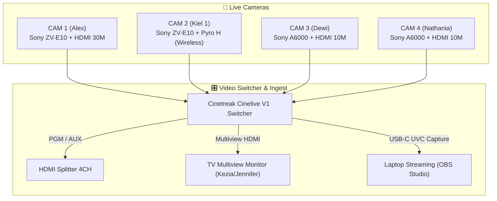
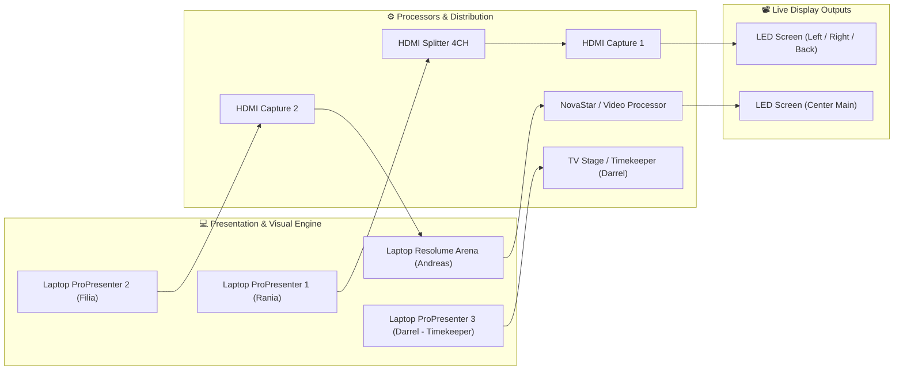
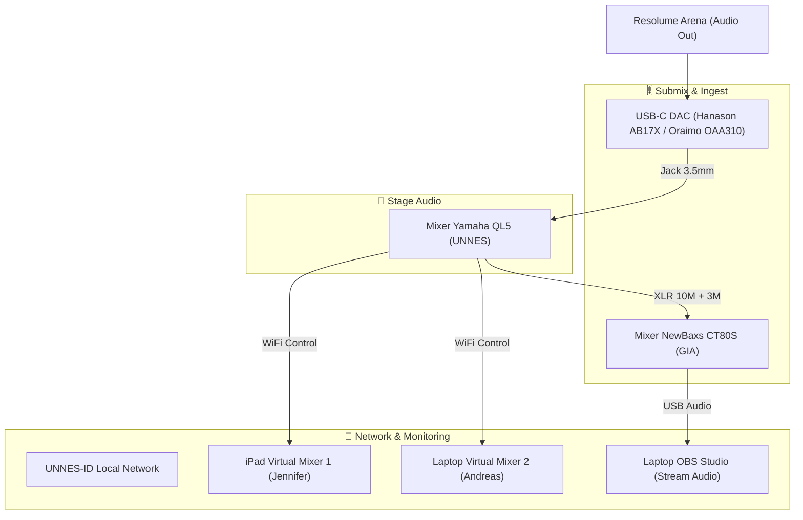

# 🎬 IBADAH PERDANA UKK UNNES 2026 — PRODUCTION & BROADCAST BLUEPRINT

<div align="center">


<p align="center">
  <b>Comprehensive Technical Architecture, Multi-Camera Broadcast Routing, Audio-Visual Signal Flows, and Master Inventory Management for Ibadah Perdana UKK UNNES 2026.</b>
</p>

---

</div>

## 📌 1. Event Overview & Metadata

| Field | Detail |
| :--- | :--- |
| **Event Name** | Ibadah Perdana UKK UNNES 2026 |
| **Venue** | Gedung Auditorium Universitas Negeri Semarang (UNNES) |
| **Organizer** | Panitia Ibadah Perdana UKK UNNES 2026 |
| **Technical & Media Lead** | Andreas & Production Team |
| **Primary System Stacks** | Cinetreak Cinelive V1, OBS Studio, Resolume Arena, ProPresenter 7, Yamaha QL5 |

---

## 👥 2. Crew Structure & Person In Charge (PIC)

```
┌────────────────────────────────────────────────────────────────────────┐
│                        MASTER PRODUCTION CREW                          │
├───────────────────┬───────────────────┬────────────────────────────────┤
│ 🎥 BROADCAST      │ 📸 DOCUMENTATION  │ 💻 MEDIA & ENGINE              │
├───────────────────┼───────────────────┼────────────────────────────────┤
│ CAM 1: Alex       │ Photo: Nico       │ Switcher: Wilfred              │
│ CAM 2: Kiel 1     │ Video: Joel       │ OBS Studio: Andreas            │
│ CAM 3: Dewi       │ Mobile: Jennifer  │ Resolume: Andreas              │
│ CAM 4: Nathania   │                   │ ProPresenter 1: Rania          │
│                   │                   │ ProPresenter 2: Filia          │
│                   │                   │ Virtual Mixer: Jordan / Yosua  │
│                   │                   │ Backup Station: Kiel 1         │
└───────────────────┴───────────────────┴────────────────────────────────┘
```

---

## 📡 3. Broadcast Camera Setup

| Camera ID | Operator | Unit / Body | Lens | Accessories & Link |
| :--- | :--- | :--- | :--- | :--- |
| **CAM 1** | **Alex** | Sony ZV-E10 | 18–105mm F4 G | Tripod Big, Micro-HDMI Conv, HDMI 20M/30M, Splitter 4CH |
| **CAM 2** | **Kiel 1** | Sony ZV-E10 | 18–105mm F4 G | Hollyland Pyro H Wireless (TX/RX), Stand Lighting, HDMI 1.5M |
| **CAM 3** | **Dewi** | Sony A6000 | 18–105mm F4 G | Tripod Big, Micro-HDMI Conv, HDMI 10M |
| **CAM 4** | **Nathania** | Sony A6000 | 16–50mm Kit | Tripod Big, Micro-HDMI Conv, HDMI 10M |

### 📸 Documentation System *(Terpisah dari Broadcast)*
* **Photo Lead:** Nico — *Sony A6400 + 50mm Prime (OWL)*
* **Cinematic Video:** Joel — *Sony A6600 + Zeiss 24–70mm + DJI Ronin RS3 Gimbal*
* **Mobile / Social Media:** Jennifer — *iPhone 15*

---

## 🔄 4. System Architecture & Signal Routing

### 🎥 A. Video & Broadcast Signal Flow


### 🖥️ B. Media Presentation, Resolume & Output Routing


### 🔊 C. Audio Master & Virtual Mixing Pipeline


---

## 📋 5. Master Inventory & Equipment Loan Log

<details open>
<summary><b>📦 Klik untuk melihat daftar peminjaman per instansi/personel</b></summary>

### 🏢 1. Peminjaman OWL
- [x] Sony A6000 (2 Unit)
- [x] Sony A6400 (1 Unit)
- [x] Sony ZV-E10 (1 Unit)
- [x] Lens 18–105mm (3 Unit)
- [x] Lens 50mm (1 Unit)
- [x] Battery NP-FW50 / NP-FZ100 (8 Unit) & Charger (1 Pack)
- [x] Memory Card 32GB (4 Unit)
- [x] Cinetreak Cinelive V1 Switcher + Power Adaptor MIX (1 Pack)
- [x] Hollyland Pyro H Wireless Kit + Power Adaptor WIR (1 Pack)
- [x] Tripod Camera Big (1 Unit)
- [x] HDMI to Micro HDMI Converter (2 Unit) & Cable 30CM (1 Unit)
- [x] HDMI Cable 30M (1 Unit) & HDMI Cable 20M (1 Unit)
- [x] HDMI Capture Card (2 Unit)

### 🏢 2. Peminjaman UKK
- [x] XLR Female to Male Cable 10M (3 Unit)
- [x] Stand Lighting Small (4 Unit)
- [x] Tripod Camera Big (1 Unit)
- [x] HDMI Cable 10M (1 Unit), HDMI Cable 1.5M (4 Unit), HDMI Cable 15M (1 Unit)
- [x] HDMI Splitter 4CH (1 Unit) & Power Adaptor SPL (1 Pack)
- [x] VGA to VGA Cables & Converters (2 Unit)
- [x] Terminal Cable XCH (X Unit)

### ⛪ 3. Peminjaman GIA Deliksari
- [x] Mixer NewBaxs CT80S (1 Unit)
- [x] XLR Female to Male Cable 3M (2 Unit)
- [x] USB-A to USB-C Data Cable (1 Unit)
- [x] Tripod Camera Big (1 Unit)
- [x] HDMI to HDMI Cable 1M (2 Unit) & Splitter 2CH (1 Unit)

### ⛪ 4. Peminjaman GKJ Ngaliyan
- [x] Stand Lighting Small (1 Unit)
- [x] HDMI Cable 15M (1 Unit) & HDMI Cable 10M (1 Unit)
- [x] HDMI Capture Card (1 Unit)
- [x] HDMI Splitter 4CH (1 Unit) & Power Adaptor SPL (1 Pack)

### 👤 5. Peminjaman Andreas (Master Toolkit)
- [x] USB-C DAC Hanason AB17X & Oraimo OAA310 (2 Unit)
- [x] In-Ear Monitors (QKZ Hi7T, KZ EDX Pro)
- [x] HDMI to HDMI Cable 1.5M (3 Unit) & Converters Pack
- [x] Fastdrive SSD Vgen 128GB, HDD Toshiba 1TB, Flashdrives Pack
- [x] Terminal Cables (2CH, 3CH, 4CH, XCH) & Terminal T (8 Unit)
- [x] Heavy Duty Tool Box, Jack Box, Screw Box, Cable Ties & Tapes

### 👥 6. Peminjaman Tim & Individual
- **ABON:** HDMI Capture Cards (2 Unit) ✅
- **Joel:** Sony A6600 + Zeiss 24–70mm + Battery (2 Unit) + Memory 64GB + DJI Ronin RS3 Gimbal ✅
- **Kiel:** Sony ZV-E10 + Kit 16–50mm + Battery (2 Unit) + Memory 64GB/128GB ✅
- **Darrel:** Television Monitor (1 Unit) + TV Adaptor + Memory Card 8GB ✅
- **Kezia & Jennifer:** Television Monitor (2 Unit) + TV Adaptor + iPhone 15 ✅
- **Panitia:** Terminal Cable XCH & HDMI Converters ✅

</details>

---

## 📑 6. Rundown & Media Asset Checklist

| Phase | Media Element | Output Channel / Destination | Status |
| :--- | :--- | :--- | :---: |
| **Pre-Ibadah** *(Open Gate)* | Playlist Lagu Rohani | Main Sound System | ⏳ Ready |
| | Loop Video UKK Profile, After Movie IP25 & IN25 | LED Center (Tengah) | ⏳ Ready |
| **Main Event** *(Ibadah)* | Video Opening Countdown | LED Center | ⏳ Ready |
| | Video Sambutan Bu Grave | LED Center + Left + Right | ⏳ Ready |
| | Background Tema & Lagu | Sound System & LED Center | ⏳ Ready |
| | Lirik Lagu Pujian & Penyembahan | LED Center + Left + Right | ⏳ Ready |
| | Video Generation Clip | LED Center + Left + Right | ⏳ Ready |
| | PPT Khotbah, Ayat & Quotes Pembicara | LED Center + Left + Right | ⏳ Ready |
| | Slide QRIS Persembahan | LED Center + Left + Right | ⏳ Ready |
| | UKK News & Pokok Doa | LED Center + Left + Right | ⏳ Ready |
| **Post-Ibadah** *(Close Gate)* | Background Music & Outro | Sound System & LED | ⏳ Ready |
| | **SOP Usung-Usung & Teardown** | All Crew & Inventory Teams | ⏳ Ready |

---

## ⚡ 7. SOP Operasional & Safety Guidelines

1. **Power & Electrical Routing:**
   - Semua distribusi daya terminal kabel harus menggunakan jalur aman bertanda proteksi (hindari daisy-chaining berlebih pada stopkontak utama).
   - Pastikan power adaptor switcher, splitter, dan mixer terpasang pada terminal stabil dengan cadangan port.
2. **Signal Integrity:**
   - Gunakan converter HDMI/Micro-HDMI berkualitas dengan klip pengaman untuk mencegah putus sinyal saat pergerakan kamera.
   - Sambungkan transmitter Hollyland Pyro H pada line-of-sight yang bebas hambatan menuju receiver station.
3. **Usung-Usung & Teardown:**
   - Setiap PIC bertanggung jawab penuh atas pengecekan fisik dan pengembalian unit pinjaman sesuai daftar inventaris di Section 5.

---

## ⚖️ 8. License & Proprietary Notice

Blueprint dan dokumen konfigurasi ini dilindungi oleh **Proprietary & Confidential License**.
Dibuat khusus untuk keperluan teknis **Ibadah Perdana UKK UNNES 2026**. 
Dilarang menyalin, mendistribusikan ulang, atau menggunakan blueprint ini untuk keperluan komersial pihak ketiga tanpa izin tertulis dari tim produksi.

© 2026 UKK UNNES Production Team & Andreas. All Rights Reserved.
