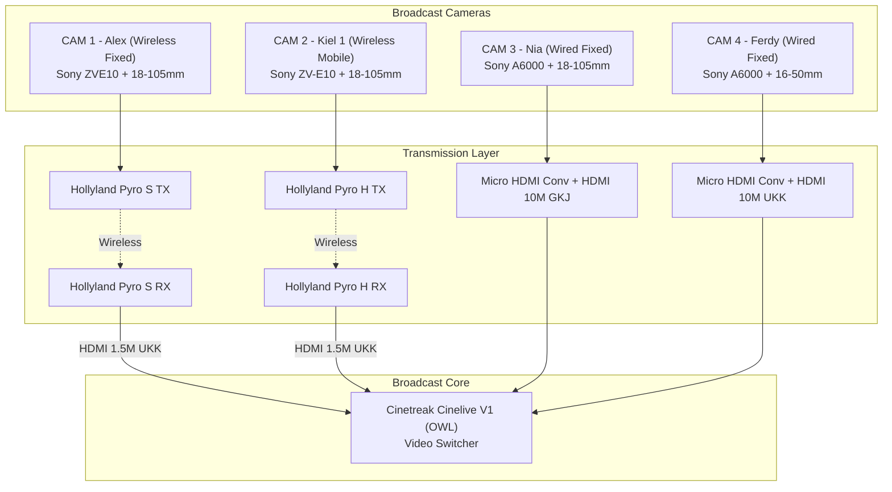
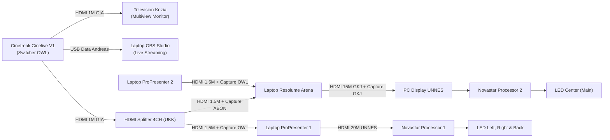
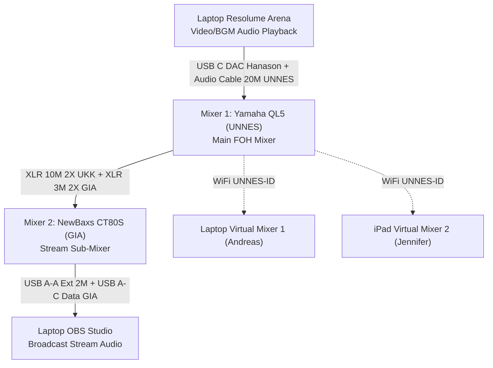

# 🎬 Ibadah Perdana UKK UNNES 2026 — Production & Media System

<div align="center">


<p align="center">
  <b>Dokumen Resmi Arsitektur Teknis, Routing Sinyal Siaran, Alokasi Workstation, Inventaris Gear, dan Rundown Konten Multimedia</b>
</p>

</div>

---

## 📑 Daftar Isi

- [📌 Informasi Acara & Ringkasan](#-informasi-acara--ringkasan)
- [🧭 Panduan Status Indikator](#-panduan-status-indikator)
- [🎥 Sistem Kamera (Camera Systems)](#-sistem-kamera-camera-systems)
  - [1. Broadcast Camera System](#1-broadcast-camera-system)
  - [2. Documentation Camera System](#2-documentation-camera-system)
- [⚡ Arsitektur Engine System](#-arsitektur-engine-system)
  - [1. Electrical & Power Routing](#1-electrical--power-routing)
  - [2. Broadcast & Video Signal Routing](#2-broadcast--video-signal-routing)
  - [3. Audio Signal & Mixing System](#3-audio-signal--mixing-system)
  - [4. Time Keeper System](#4-time-keeper-system)
- [💻 Alokasi Workstation & Operator Matrix](#-alokasi-workstation--operator-matrix)
- [📦 Master Inventory & Equipment Loan Directory](#-master-inventory--equipment-loan-directory)
- [📋 Rundown Konten & Tampilan Layar](#-rundown-konten--tampilan-layar)
- [📜 Hak Cipta & Lisensi](#-hak-cipta--lisensi)

---

## 📌 Informasi Acara & Ringkasan

| Parameter | Keterangan |
| :--- | :--- |
| **Nama Acara** | Ibadah Perdana UKK UNNES 2026 |
| **Lokasi** | Gedung Auditorium Universitas Negeri Semarang (UNNES) |
| **Pelaksana Teknis** | Panitia Ibadah Perdana 2026 — Divisi Media, Broadcast & Multimedia |
| **Target Output** | Multi-Screen LED (Center, Left, Right, Back Stage), Live Streaming OBS, dan FOH Sound System |

### 📊 Quick Stats Overview
```
┌─────────────────┐   ┌─────────────────┐   ┌─────────────────┐   ┌─────────────────┐
│    7 KAMERA     │   │ 10 WORKSTATION  │   │  13 SUMBER GEAR │   │   11 OPERATOR   │
│ 4 Broad + 3 Doc │   │ Audio, Video, PC│   │ Rental & Pinjam │   │ PIC Bertugas    │
└─────────────────┘   └─────────────────┘   └─────────────────┘   └─────────────────┘
```

---

## 🧭 Panduan Status Indikator

Setiap item dan jalur routing dalam dokumen ini diklasifikasikan menggunakan indikator status standar:

| Simbol | Status | Definisi Operasional |
| :---: | :--- | :--- |
| `✅` | **Terverifikasi & Aktif** | Barang telah terverifikasi dan terpasang aktif di sistem/routing utama. |
| `⚠️` | **Perhatian / Sebagian / Pending** | Barang dipakai sebagian (disertai rasio pemakaian, contoh: `2/4`) atau workstation berstatus *Belum Ada*. |
| `☑️` | **Standby / Backup** | Barang tersedia di inventaris/storage sebagai unit cadangan (tidak tersambung aktif). |

---

## 🎥 Sistem Kamera (Camera Systems)

### 1. Broadcast Camera System
Terintegrasi langsung ke Video Switcher (*Cinetreak Cinelive V1*) untuk produksi siaran langsung (*multicam live production*).



#### Rincian Spesifikasi Rig & Wiring Kamera Siaran:

1. **CAM 1 — Wireless + Fixed (Operator: Alex) `✅`**
   - **Kamera & Optik:** Sony ZVE10 (Kiel 1) + Lens 18-105MM (OWL)
   - **Power & Storage:** Battery (Kiel 1) + Memory Card 64GB (Kiel 1)
   - **Support Rig:** Tripod Camera Big (OWL)
   - **Transmisi:** HDMI to Micro HDMI Cable 30CM (OWL) + Hollyland Pyro S Transmitter (OWL) + Battery WIR (OWL) + Hollyland Pyro S Receiver (OWL) + Battery WIR (OWL)
   - **Receiver Rig:** Stand Lighting Small (UKK) + HDMI Cable 1,5M (UKK) ➔ Switcher Input

2. **CAM 2 — Wireless + Mobile (Operator: Kiel 1) `✅`**
   - **Kamera & Optik:** Sony ZV-E10 (OWL) + Lens 18-105MM (OWL)
   - **Power & Storage:** Battery (OWL) + Memory Card 32GB (OWL)
   - **Transmisi:** HDMI to Micro HDMI Cable 30CM (OWL) + Hollyland Pyro H Transmitter (OWL) + Battery WIR (OWL) + Hollyland Pyro H Receiver (OWL) + Battery WIR (OWL)
   - **Receiver Rig:** Stand Lighting Small (UKK) + HDMI Cable 1,5M (UKK) ➔ Switcher Input

3. **CAM 3 — Wired + Fixed (Operator: Nia) `✅`**
   - **Kamera & Optik:** Sony A6000 (OWL) + Lens 18-105MM (OWL)
   - **Power & Storage:** Battery (OWL) + Memory Card 32GB (OWL)
   - **Support Rig:** Tripod Camera Big (GIA)
   - **Kabel & Konversi:** Micro HDMI to HDMI Converter (OWL) + HDMI Cable 10M (GKJ) ➔ Switcher Input

4. **CAM 4 — Wired + Fixed (Operator: Ferdy) `✅`**
   - **Kamera & Optik:** Sony A6000 (OWL) + Lens 16-50MM Kit (Kiel 1)
   - **Power & Storage:** Battery (OWL) + Memory Card 32GB (OWL)
   - **Support Rig:** Tripod Camera Big (UKK)
   - **Kabel & Konversi:** Micro HDMI to HDMI Converter (OWL) + HDMI Cable 10M (UKK) ➔ Switcher Input

5. **Backup Converter `✅`**
   - Micro HDMI to HDMI Converter X2 (Panitia)

---

### 2. Documentation Camera System
Sistem dokumentasi foto, sinematik video, dan liputan media sosial yang beroperasi secara *independen* dari jalur siaran:

| Unit | Perangkat & Spesifikasi Rig | Operator (PIC) | Output / Tugas | Status |
| :--- | :--- | :--- | :--- | :---: |
| **CAM PHO** | Sony A6400 (OWL) + Lens 50MM Fix (OWL) + Battery X2 (OWL) + Memory Card 32GB (OWL) | **Nico** | Foto Dokumentasi & Liputan Acara | `✅` |
| **CAM VID** | Sony A6600 (Joel) + Lens 24-70MM Zeiss (Joel) + Battery X2 (Joel) + Memory Card 64GB (Joel) + Gimbal DJI Ronin RS3 (Joel) | **Joel** | Video Aftermovie & Video Highlight | `✅` |
| **CAM HP** | iPhone 15 (Jennifer) | **Jennifer** | Instagram Story, Reels & Live Media | `✅` |

---

## ⚡ Arsitektur Engine System

### 1. Electrical & Power Routing
Infrastruktur catu daya terpusat untuk meja produksi media:
- `Terminal Cable XCH (Andreas) + Terminal Cable XCH (UKK) + Terminal Cable XCH (Panitia)` — `✅`

---

### 2. Broadcast & Video Signal Routing



#### Tabel Rincian Jalur Video:

| Alur Sinyal | Rincian Jalur Kabel, Konverter & Perangkat | Status |
| :--- | :--- | :---: |
| **Switcher ➔ TV Multiview** | Terminal Cable XCH (UKK) + Cinetreak Cinelive V1 (OWL) + Power Adaptor MIX (OWL) + HDMI to HDMI Cable 1M (GIA) + Television (Kezia) + Power Adaptor TV (Kezia) | `✅` |
| **Switcher ➔ HDMI Splitter**| Terminal Cable XCH (UKK) + Cinetreak Cinelive V1 (OWL) + Power Adaptor MIX (OWL) + HDMI to HDMI Cable 1M (GIA) + HDMI Splitter 4CH (UKK/GKJ) + Power Adaptor SPL (UKK/GKJ) | `✅` |
| **Switcher ➔ OBS Studio** | Terminal Cable XCH (UKK) + Cinetreak Cinelive V1 (OWL) + Power Adaptor MIX (OWL) + USB A to USB C Data Cable (Andreas) + Laptop (OBS Studio) + Power Adaptor LTP (OBS Studio) | `✅` |
| **Splitter ➔ PRO 1 ➔ LED L/R/Back** | HDMI Splitter 4CH (UKK/GKJ) + Power Adaptor SPL (UKK/GKJ) + HDMI to HDMI Cable 1,5M (Andreas) + HDMI Capture (OWL) + Laptop (Pro Presenter 1) + Power Adaptor LTP (Pro Presenter 1) + HDMI Cable 20M (UNNES) + Novastar Video Processor (UNNES) + LED Left Right Back (UNNES) | `✅` |
| **PRO 2 ➔ Resolume Arena** | Laptop (Pro Presenter 2) + Power Adaptor LTP (Pro Presenter 2) + HDMI to HDMI Cable 1,5M (Andreas) + HDMI Capture (OWL) + Laptop (Resolume Arena) + Power Adaptor LTP (Resolume Arena) | `✅` |
| **Splitter ➔ Resolume ➔ LED Center** | HDMI Splitter 4CH (UKK/GKJ) + Power Adaptor SPL (UKK/GKJ) + HDMI to HDMI Cable 1,5M (Andreas) + HDMI Capture (ABON) + Laptop (Resolume Arena) + Power Adaptor LTP + HDMI Cable 15M (GKJ) + HDMI Capture (GKJ) + PC (UNNES) + Novastar Video Processor (UNNES) + LED Center (UNNES) | `✅` |

> [!NOTE]
> **Strategi & Cadangan HDMI Splitter:**
> - Unit Utama: **UKK 4-Channel Splitter** `✅`
> - Unit Cadangan 1: **GKJ Ngaliyan 4-Channel Splitter** `☑️`
> - Unit Cadangan 2: **GIA Deliksari 2-Channel Splitter** `☑️`
> Semua unit dilengkapi dengan Power Adaptor SPL masing-masing.

---

### 3. Audio Signal & Mixing System



| Jalur Audio | Konfigurasi Wiring & Antarmuka | Status |
| :--- | :--- | :---: |
| **Mixer 1 (FOH) ➔ Mixer 2 ➔ OBS** | Mixer Yamaha QL5 (UNNES) + XLR Female to Male Cable 10M 2X (UKK) + XLR Female to Male Cable 3M 2X (GIA) + Mixer NewBaxs CT80S (GIA) + USB A to USB A Extender 2M (Andreas) + USB A to USB C Data Cable (GIA) + Laptop (OBS Studio) + Power Adaptor LTP (OBS Studio) | `✅` |
| **Resolume (Playback) ➔ Mixer 1** | Laptop (Resolume Arena) + Power Adaptor LTP (Resolume Arena) + USB C DAC Hanason AB17X (Andreas) + Audio Cable 20M (UNNES) + Mixer Yamaha QL5 (UNNES) | `✅` |
| **Mixer 1 ➔ Virtual Mixer 1** | Mixer Yamaha QL5 (UNNES) + Jaringan WiFi (UNNES-ID) + Laptop (Virtual Mixer 1) + Power Adaptor LTP (Virtual Mixer 1) | `✅` |
| **Mixer 1 ➔ Virtual Mixer 2** | Mixer Yamaha QL5 (UNNES) + Jaringan WiFi (UNNES-ID) + iPad (Virtual Mixer 2) | `✅` |

---

### 4. Time Keeper System
Sistem monitor hitung mundur / timer panggung mandiri:
- `Terminal Cable XCH (UKK) + Laptop (Pro Presenter 3) + Power Adaptor LTP (Pro Presenter 3) + HDMI to HDMI Cable 1.5M (Lio) + Television (Darrel) + Power Adaptor TV (Darrel)` — `✅`

---

## 💻 Alokasi Workstation & Operator Matrix

Matriks tanggung jawab operator dan alokasi perangkat keras:

| Workstation / Peran | Perangkat Keras & Kepemilikan | Operator (PIC) | Status Kesiapan |
| :--- | :--- | :--- | :---: |
| **Mixer 1 (FOH Console)** | Yamaha QL5 (UNNES) | Jordan / Yosua | `✅` Siap |
| **Mixer 2 (Sub-Mixer Stream)**| NewBaxs CT80S (GIA) | Andreas | `✅` Siap |
| **Virtual Mixer 1** | Laptop + Power Adaptor LTP (Andreas) | Jordan / Yosua | `✅` Siap |
| **Virtual Mixer 2** | iPad (Jennifer) | Jordan / Yosua | `✅` Siap |
| **Resolume Arena** | Laptop + Power Adaptor LTP (Bayu) | Andreas | `✅` Siap |
| **Pro Presenter 1 (LED L/R/Back)**| Laptop + Power Adaptor LTP *(Belum Ada)* | Rania | `⚠️` Belum Ada |
| **Pro Presenter 2 (Lirik & Ayat)** | Laptop + Power Adaptor LTP *(Belum Ada)* | Filia | `⚠️` Belum Ada |
| **Pro Presenter 3 + TV (Timer)** | Laptop X + Power Adaptor *(Belum Ada)* + TV (Darrel) | Acara | `⚠️` Belum Ada |
| **Switcher + TV Multiview** | Cinetreak Cinelive V1 (OWL) + TV (Kezia) | Wilfred | `✅` Siap |
| **OBS Studio (Livestream Engine)**| Laptop X + Power Adaptor LTP *(Belum Ada)* | Andreas | `⚠️` Belum Ada |
| **Backup Laptop** | Laptop + Power Adaptor LTP (Kiel 1) | Kiel 1 | `✅` Siap |

> [!WARNING]
> **Daftar Kebutuhan Kritis (Pending Laptops):**
> Masih diperlukan konfirmasi dan pengadaan unit laptop untuk 4 stasiun berikut:
> 1. Laptop Pro Presenter 1 (Operator: Rania)
> 2. Laptop Pro Presenter 2 (Operator: Filia)
> 3. Laptop Pro Presenter 3 (Operator: Acara)
> 4. Laptop OBS Studio (Operator: Andreas)

---

## 📦 Master Inventory & Equipment Loan Directory

<details open>
<summary><b>1. Peminjaman dari OWL (17 Item)</b></summary>

- Sony A6000 (2 Unit) `✅`
- Sony A6400 (1 Unit) `✅`
- Sony ZV-E10 (1 Unit) `✅`
- Lens 18-105MM (3 Unit) `✅`
- Lens 50MM (1 Unit) `✅`
- Battery (8 Unit) `✅`
- Charger (1 Pack) `✅`
- Memory Card 32GB (4 Unit) `✅`
- Cinetreak Cinelive V1 (1 Pack) `✅`
- Power Adaptor MIX (1 Unit) `✅`
- Hollyland Pyro H (1 Pack) `✅`
- Hollyland Pyro S (1 Pack) `✅`
- Battery WIR (4 Unit) `✅`
- Tripod Camera Big (1 Unit) `✅`
- HDMI to Micro HDMI Converter (2 Unit) `✅`
- HDMI to Micro HDMI Cable 30CM (2 Unit) `✅`
- HDMI Capture (2 Unit) `✅`
</details>

<details>
<summary><b>2. Peminjaman dari ABON (1 Item)</b></summary>

- HDMI Capture (2 Unit) `⚠️ 1/2` *(1 unit digunakan di Resolume, 1 unit standby)*
</details>

<details>
<summary><b>3. Peminjaman dari Andreas (44 Item)</b></summary>

- Fan Cooler (1 Unit) `☑️`
- Mouse Pad (1 Unit) `☑️`
- Keyboard Ext (1 Unit) `☑️`
- Mouse Ext (1 Unit) `☑️`
- Powerbank (1 Unit) `☑️`
- Power Adaptor USB A (9 Unit) `☑️`
- Power Adaptor USB A x C (1 Unit) `☑️`
- Power Adaptor USB C (1 Unit) `☑️`
- USB A to USB B Data Cable (1 Unit) `☑️`
- USB A to USB Micro B Data Cable (2 Unit) `☑️`
- USB A to USB C Data Cable (1 Unit) `✅`
- USB A to USB C Charge Cable (1 Unit) `☑️`
- USB C to USB C Charge Cable (1 Unit) `☑️`
- USB A to USB A Extender 30CM (2 Unit) `☑️`
- USB A to USB A Extender 2M (1 Unit) `✅`
- USB A to USB C Male Converter (4 Unit) `☑️`
- USB A to USB C Female Converter (2 Unit) `☑️`
- USB A to Mini USB Cable (1 Unit) `☑️`
- USB A Splitter 3CH (1 Unit) `☑️`
- USB A Splitter 4CH (1 Unit) `☑️`
- USB C DAC Hanason AB17X (1 Unit) `✅`
- USB C DAC Oraimo OAA310 (1 Unit) `☑️`
- In Ear Monitor QKZ Hi7T (1 Pack) `☑️`
- In Ear Monitor KZ EDX Pro (1 Pack) `☑️`
- Fastdrive Vgen SSD 128GB (1 Pack) `☑️`
- Fastdrive Toshiba HDD 1TB (1 Pack) `☑️`
- Flashdrive Toshiba 8GB (1 Unit) `☑️`
- Flashdrive Sandisk 16GB (1 Unit) `☑️`
- Flashdrive Toshiba 32GB (1 Unit) `☑️`
- Flashdrive Toshiba 64GB (1 Unit) `☑️`
- HDMI to Mini HDMI Converter (1 Unit) `☑️`
- Mini HDMI to Mini HDMI Cable 1,5M (1 Unit) `☑️`
- HDMI to HDMI Cable 1,5M (3 Unit) `✅`
- VGA to HDMI Converter (3 Unit) `☑️`
- VGA to VGA Cable 1,5M (1 Unit) `☑️`
- Power Cable 3PIN (3 Unit) `⚠️`
- Power Cable 2PIN (1 Unit) `⚠️`
- Terminal Cable 4CH (3 Unit) `⚠️`
- Terminal Cable 3CH (2 Unit) `⚠️`
- Terminal Cable 2CH (1 Unit) `⚠️`
- Terminal Cable XCH (X Unit) `✅`
- Terminal T (8 Unit) `⚠️`
- Addon Box (1 Pack) `☑️`
- Jack Box (1 Pack) `☑️`
- Screw Box (1 Pack) `☑️`
- Ties Box (1 Pack) `☑️`
- Tool Box (2 Pack) `☑️`
- Cable (1 Pack) `☑️`
- Tape (1 Pack) `☑️`
</details>

<details>
<summary><b>4. Peminjaman dari GIA Deliksari (7 Item)</b></summary>

- Mixer NewBaxs CT80S `✅`
- XLR Female to Male Cable 3M (2 Unit) `✅`
- USB A to USB C Data Cable (1 Unit) `✅`
- Tripod Camera Big (1 Unit) `✅`
- HDMI Splitter 2CH (1 Unit) `☑️`
- Power Adaptor SPL (1 Pack) `☑️`
- HDMI to HDMI Cable 1M (2 Unit) `✅`
</details>

<details>
<summary><b>5. Peminjaman dari GKJ Ngaliyan (8 Item)</b></summary>

- Stand Lighting Small (1 Unit) `☑️`
- HDMI Cable 15M (1 Unit) `✅`
- HDMI Cable 10M (1 Unit) `✅`
- HDMI Cable 5M (1 Unit) `☑️`
- HDMI Cable 1,5M (1 Unit) `☑️`
- HDMI Capture (1 Unit) `✅`
- HDMI Splitter 4CH (1 Unit) `☑️`
- Power Adaptor SPL (1 Pack) `☑️`
</details>

<details open>
<summary><b>6. Peminjaman dari UKK UNNES (14 Item)</b></summary>

- XLR Female to Male Cable 10M (3 Unit) `⚠️ 2/3`
- Stand Lighting Small (4 Unit) `⚠️ 2/4`
- Tripod Camera Big (1 Unit) `✅`
- HDMI to Mini HDMI Cable 2,5M (1 Unit) `☑️`
- HDMI Cable 15M (1 Unit) `☑️`
- HDMI Cable 10M (1 Unit) `✅`
- HDMI Cable 1,5M (4 Unit) `⚠️ 2/4`
- HDMI Splitter 4CH (1 Unit) `✅`
- Power Adaptor SPL (1 Pack) `✅`
- VGA to VGA Cable 1,5M (1 Unit) `☑️`
- VGA to VGA Cable 2,5M (1 Unit) `☑️`
- VGA to HDMI Converter (2 Unit) `☑️`
- Power Cable XPIN (X Unit) `☑️`
- Terminal Cable XCH (X Unit) `✅`
</details>

<details>
<summary><b>7. Peminjaman Personal & Panitia</b></summary>

- **Lio:** HDMI Cable 1,5M (1 Unit) `✅`
- **Darrel:** Television (1 Unit) `✅` + Power Adaptor TV (1 Pack) `✅` + Memory Card 8GB (1 Unit) `☑️`
- **Kiel 1:** Sony ZVE10 (1 Unit) `✅` + Lens 16-50MM Kit (1 Unit) `✅` + Lens 50MM Fix (1 Unit) `☑️` + Battery (2 Unit) `✅` + Charger (1 Pack) `✅` + Memory Card 64GB (1 Unit) `✅` + Memory Card 128GB (1 Unit) `☑️`
- **Joel:** Sony A6600 (1 Unit) `✅` + Lens 24-70MM Zeiss (1 Unit) `✅` + Battery (2 Unit) `✅` + Charger (1 Pack) `✅` + Memory Card 64GB (1 Unit) `✅` + Gimbal DJI Ronin RS3 (1 Unit) `✅`
- **Kezia:** Television (1 Unit) `✅` + Power Adaptor TV (1 Pack) `✅`
- **Jennifer:** HP iPhone 15 (1 Unit) `✅` + TAB iPad (1 Unit) `✅`
- **Panitia:** HDMI to Micro HDMI Converter (2 Unit) `✅` + Terminal Cable XCH (X Unit) `✅`
</details>

---

## 📋 Rundown Konten & Tampilan Layar

Distribusi penayangan konten multimedia per sesi ibadah:

```
                  ┌─────────────────────────────────────────────────────┐
                  │                 RUNDOWN TAMPILAN                    │
                  ├───────────────────┬─────────────────────────────────┤
                  │ Pre-Ibadah        │ BGM Lagu Rohani + Loop Video    │
                  │ Main Ibadah       │ Live Multi-Cam + Lyrics + PPT   │
                  │ Post-Ibadah       │ De-rigging & Inventory Packing  │
                  └───────────────────┴─────────────────────────────────┘
```

### 1. Pre Ibadah (Open Gate)
- **Audio:** Playlist Lagu Rohani ➔ *FOH Sound System*
- **Visual:** Loop Video (*Profile UKK, After Movie IP25, After Movie IN25*) ➔ *LED Tengah*

### 2. Main Ibadah (Main Event)
- **Video Opening** ➔ *LED Tengah*
- **Video Sambutan Bu Grace** ➔ *LED Tengah & Kanan-Kiri*
- **Background Tema** ➔ *LED Tengah*
- **Background Lagu** ➔ *FOH Sound System*
- **Lirik Lagu** ➔ *LED Tengah & Kanan-Kiri*
- **Video Generation** ➔ *LED Tengah & Kanan-Kiri*
- **PPT Pembicara** ➔ *LED Tengah & Kanan-Kiri*
- **Ayat Pembicara** ➔ *LED Tengah & Kanan-Kiri*
- **Quote Pembicara** ➔ *LED Tengah & Kanan-Kiri*
- **Persembahan (QRIS)** ➔ *LED Tengah & Kanan-Kiri*
- **UKK News** ➔ *LED Tengah & Kanan-Kiri*
- **Pokok Doa** ➔ *LED Tengah & Kanan-Kiri*

### 3. Post Ibadah (Close Gate)
- **Usung-Usung & De-rigging:** Pembersihan panggung, inventarisasi ulang gear, dan packing kembali ke masing-masing pihak peminjam.

---

## 📜 Hak Cipta & Lisensi

Dokumen dan konfigurasi teknis ini dilindungi di bawah lisensi **Internal Operational & Production Crew License**. Akses publik disediakan khusus untuk kemudahan koordinasi tim dan crew divisi media Ibadah Perdana UKK UNNES 2026. Lihat file [LICENSE](LICENSE) untuk detail lengkap.

---

<div align="center">
  <b>Panitia Ibadah Perdana UKK UNNES 2026</b><br/>
  <i>Divisi Media, Broadcast & Multimedia Production</i>
</div>
