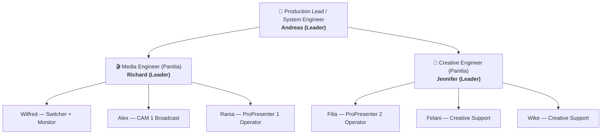
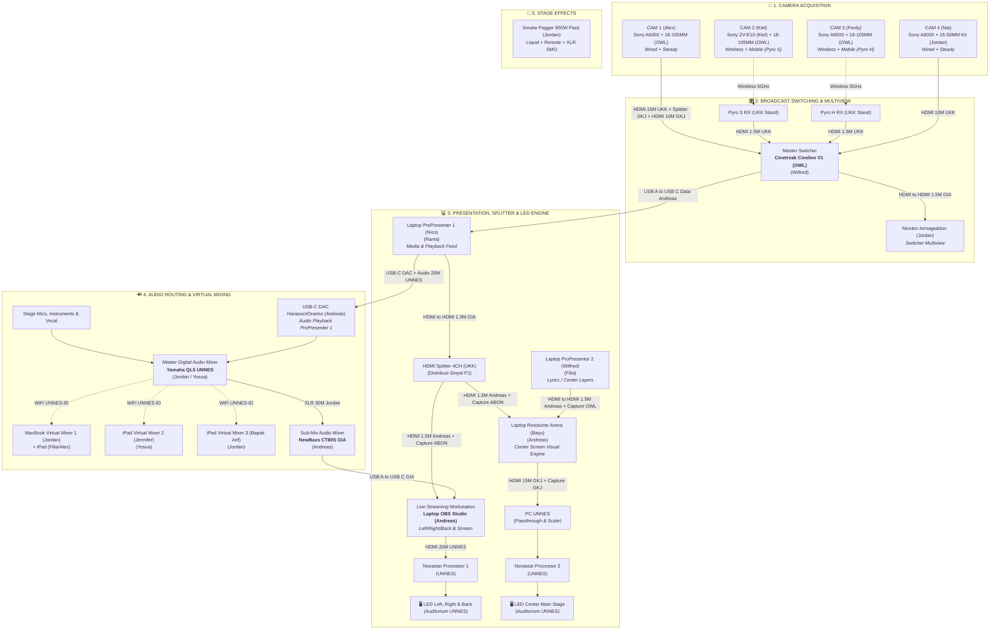
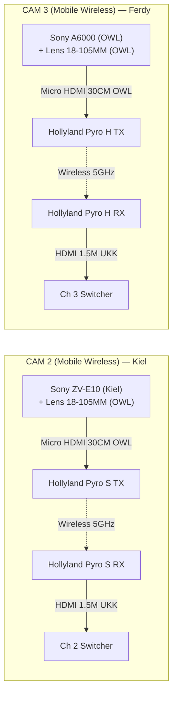
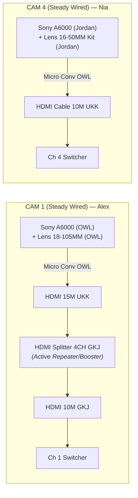
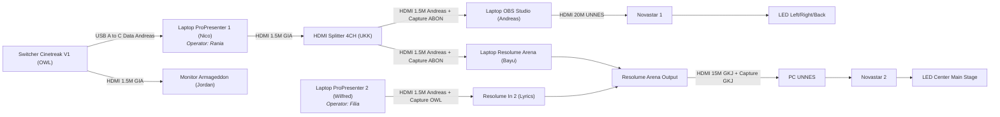
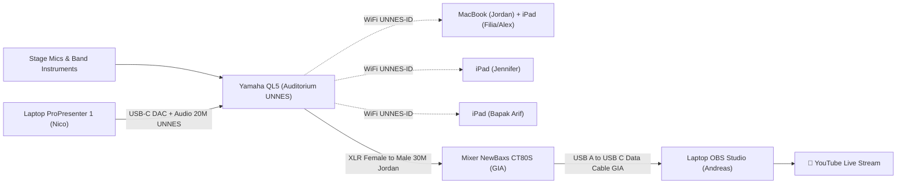
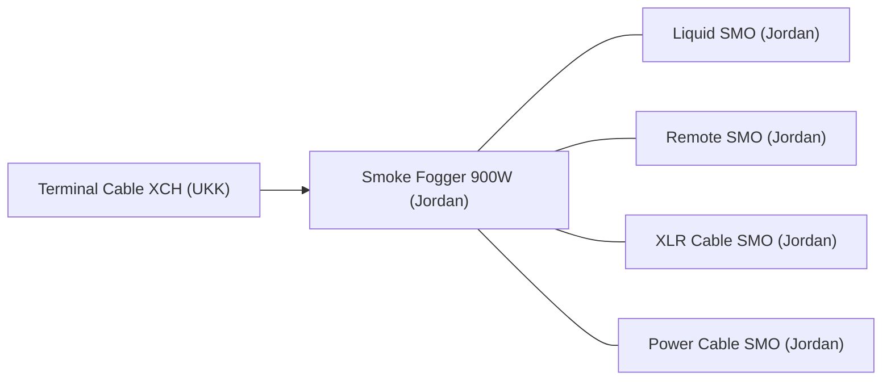
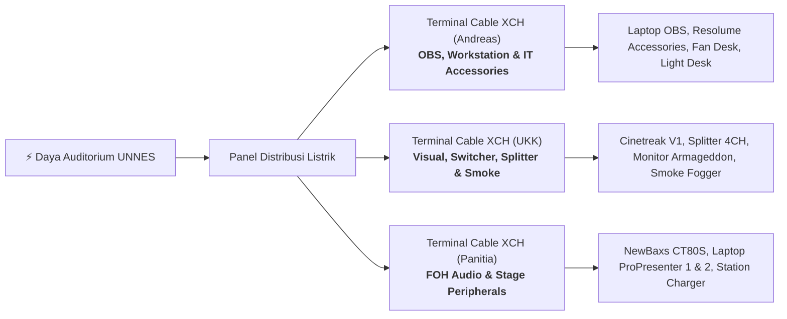

# 🎥 Ibadah Perdana UKK UNNES 2026 — Production & Technical Master Guide

<div align="center">

[](https://zzdree.github.io/ip26-production/)
[](https://zzdree.github.io/ip26-production/inventory.html)
[](https://zzdree.github.io/ip26-production/switcher.html)
[](https://zzdree.github.io/ip26-production/presenter.html)
[](#)
[](#)
[](#)
[](./LICENSE)

<br/>

[](#)
[](#)
[](#)
[](#)
[](#)
[](#)
[](#)
[](#)

</div>

> **Dokumentasi Terpadu Arsitektur Sistem Produksi, Manajemen Inventaris 18 Vendor Peminjaman, Routing Audio-Visual, Diagram Sinyal Master & Sub-Sistem, Serta Eksekusi Multimedia Ibadah Perdana UKK UNNES 2026.**

---

## 📌 Repository Live Deployments & Quick Access Links

| Layanan / Modul | URL Live (GitHub Pages) | File Lokal / Direktori | Deskripsi & Fungsi |
| :--- | :--- | :--- | :--- |
| 🌐 **Master Command Portal** | [https://zzdree.github.io/ip26-production/](https://zzdree.github.io/ip26-production/) | [`index.html`](./index.html) | Portal komando lengkap: arsitektur sistem, 8 diagram sinyal, tabel 150 logistik, device matrix, & rundown. |
| 📦 **Inventaris Lapangan (Mobile)** | [https://zzdree.github.io/ip26-production/inventory.html](https://zzdree.github.io/ip26-production/inventory.html) | [`inventory.html`](./inventory.html) & [`inventory/`](./inventory/index.html) | Mode taktis smartphone kru hari H: checklist inventaris alat & logistik 18 vendor, centang cepat pemasangan (*Loading-In*) & pengemasan (*Packing-Out*). |
| 🎛️ **Switcher Cinelive V1 (Desktop)** | [https://zzdree.github.io/ip26-production/switcher/](https://zzdree.github.io/ip26-production/switcher/) atau [switcher.html](https://zzdree.github.io/ip26-production/switcher.html) | [`switcher.html`](./switcher.html) & [`switcher/`](./switcher/index.html) | Simulator hardware Cinetreak Cinelive V1 (*Desktop Only*): 4 kamera ISO, LCD 5.5", HDMI 2 AUX Monitor (MV 6-split / ISO / PGM / PVW), T-Bar 10-LED ladder meter, rotary menu encoder OSD, CUT/AUTO, PIP, FTB. |
| 🎶 **ProPresenter Simulator (Desktop)** | [https://zzdree.github.io/ip26-production/presenter/](https://zzdree.github.io/ip26-production/presenter/) atau [presenter.html](https://zzdree.github.io/ip26-production/presenter.html) | [`presenter.html`](./presenter.html) & [`presenter/`](./presenter/index.html) | Simulator ProPresenter 7 (*Desktop Only*): 3-column layout workstation, 14 lagu dari `Assets/Lyrics/Statics`, pemutar YouTube backing track sinkron, slides 1-2 baris, Stage Display & Audience Monitor. |

| Atribut | Keterangan |
| :--- | :--- |
| **Event** | Ibadah Perdana UKK UNNES 2026 |
| **Venue** | Gedung Auditorium Prof. Wuryanto, Universitas Negeri Semarang |
| **Organizer / Production** | Panitia Ibadah Perdana 2026 |
| **License** | **Private & Confidential** (Internal Production & Technical Team Use Only) |
| **Repository Topics** | `live-production`, `broadcast-system`, `multimedia`, `resolume-arena`, `propresenter`, `obs-studio`, `audio-engineering`, `video-routing`, `ukk-unnes`, `live-streaming` |

### 📝 Short Description (About)
> *Master documentation & technical pipeline for IP26 Live Broadcast & Multimedia Production at Auditorium Prof. Wuryanto UNNES — covering camera routing, audio sub-mixing, LED video processing, inventory tracking across 18 lenders, and rundown execution.*

---

## ☁️ 3-Layer Cloud-Only Architecture (Realtime Sync & Automated Backup)

Sistem checklist logistik dan sinkronisasi lapangan beroperasi di atas **100% Cloud-Only Architecture** tanpa ketergantungan server lokal, menjamin keandalan saat hari H:

| Layer | Komponen Cloud | Peran & Mekanisme Lapangan |
| :---: | :--- | :--- |
| **Layer 1** | **Supabase Cloud Database** | PostgreSQL Realtime CDC sebagai *single source of truth* untuk 245 barang dari 18 vendor. Dilengkapi keep-alive bot otomatis via cron GitHub Actions (`supabase-keep-alive.yml`) agar database tidak pernah tertidur. |
| **Layer 2** | **ntfy.sh Cloud Relay** | Zero-setup Server-Sent Events (SSE) Pub/Sub (`ntfy.sh/ip26_checklist_sync_2026`) untuk siaran kilat sub-detik antar smartphone kru di lapangan tanpa perlu akun/login. |
| **Layer 3** | **GitHub Cloud Snapshot** | GitHub Actions workflow (`db-backup.yml`) yang otomatis mengambil snapshot JSON deterministik berkala dan menyimpannya langsung ke file [`backup/inventory_backup.json`](./backup/inventory_backup.json) di repository. |

---

## 👥 Struktur Organisasi & Komando Produksi



### 1. System Engineer (Pelayan)
- **Andreas** (Leader)

### 2. Media Engineer (Panitia)
- **Richard** (Leader)
- **Wilfred**
- **Alex**
- **Rania**

### 3. Creative Engineer (Panitia)
- **Jennifer** (Leader)
- **Filia**
- **Felani**
- **Wike**

> [!NOTE]
> **Prinsip & Aturan Penugasan Tim:**
> - Panitia bisa menjadi pelayan teknis.
> - Pelayan belum tentu panitia struktural.
> - PIC ada yang menjadi panitia.
> - PIC yang bukan panitia berarti pelayan teknis.
> - Seluruh PIC dan Pelayan memegang tanggung jawab teknis operasional yang setara di lapangan.

---

## 🗺️ MASTER ARCHITECTURE FLOWCHART

Diagram berikut menggambarkan **keseluruhan ekosistem teknis terintegrasi** yang mencakup input video 4 kamera siaran, switching & multiview monitor, pemrosesan visual LED (ProPresenter 1 & 2, Resolume Arena, PC UNNES, Novastar), distribusi audio digital & analog FOH, kontrol nirkabel FOH (Virtual Mixer 1, 2, 3), streaming OBS, hingga efek panggung (*Smoke Fogger*).



---

## 🔍 DETAIL 6 SUB-SISTEM TEKNIS & SIGNAL FLOWCHARTS

---

### Sub-Flowchart 1: Sub-Sistem Kamera Wireless — CAM 2 & CAM 3



#### 📖 Penjelasan Teknis Sub-Sistem Kamera Wireless:
1. **CAM 2 (Kiel - Mobile Wireless):** Sony ZV-E10 milik Kiel dipasangi Lensa 18-105MM OWL, Baterai x2 Kiel, dan Micro HDMI 30CM OWL ke Hollyland Pyro S TX. Receiver Pyro S RX diletakkan pada Stand Lighting Small UKK dan dialirkan ke Switcher Ch 2 via HDMI 1,5M UKK.
2. **CAM 3 (Ferdy - Mobile Wireless):** Sony A6000 OWL dipasangi Lensa 18-105MM OWL, Tripod Camera Big GIA, dan Micro HDMI 30CM OWL ke Hollyland Pyro H TX. Receiver Pyro H RX terpasang di Stand Lighting Small UKK dan dialirkan ke Switcher Ch 3 via HDMI 1,5M UKK.

---

### Sub-Flowchart 2: Sub-Sistem Kamera Kabel / Wired — CAM 1 & CAM 4



#### 📖 Penjelasan Teknis Sub-Sistem Kamera Wired:
1. **CAM 1 (Alex - Steady Wired):** Kamera sudut utama auditorium dengan Tripod Big OWL. Menggunakan rantai jarak jauh: HDMI to Micro HDMI Converter OWL $\rightarrow$ Kabel HDMI 15M UKK $\rightarrow$ HDMI Splitter 4CH GKJ (sebagai *active powered signal repeater*) $\rightarrow$ Kabel HDMI 10M GKJ menuju Switcher Ch 1.
2. **CAM 4 (Nia - Steady Wired):** Kamera sudut panggung sayap dengan Tripod Big UKK. Menggunakan Sony A6000 Jordan, Lensa Kit 16-50MM Jordan, Baterai x2 Jordan, Converter Micro HDMI OWL, dan Kabel HDMI 10M UKK langsung ke Switcher Ch 4.
3. **Redundansi / Backup:** 2 unit HDMI to Micro HDMI Converter Panitia disiagakan di kotak perkakas untuk antisipasi kerusakan konektor port kamera.

---

### Sub-Flowchart 3: Sub-Sistem Distribusi Video & Pemetaan LED



#### 📖 Penjelasan Teknis Sub-Sistem Visual & LED:
1. **Koneksi Switcher $\rightarrow$ ProPresenter 1:** Video PGM dari Cinetreak dialirkan langsung ke Laptop ProPresenter 1 (Nico) via USB A to USB C Data Cable Andreas untuk diintegrasikan dengan layer grafis.
2. **Distribusi Splitter 4CH UKK:** Laptop ProPresenter 1 mengalirkan sinyal via HDMI 1,5M GIA ke Splitter 4CH UKK, kemudian dibagi dua:
   - Ke Laptop OBS Studio (Andreas) via HDMI 1,5M Andreas + HDMI Capture ABON.
   - Ke Laptop Resolume Arena (Bayu) via HDMI 1,5M Andreas + HDMI Capture ABON.
3. **OBS Studio $\rightarrow$ LED Sayap & Belakang:** Laptop OBS Studio meneruskan visual komposit via kabel HDMI 20M UNNES ke Novastar Video Processor 1 untuk layar LED Left, Right, & Back.
4. **ProPresenter 2 $\rightarrow$ Resolume Arena:** Laptop ProPresenter 2 (Wilfred) dioperasikan Filia mengalirkan lirik/materi melalui HDMI to HDMI 1,5M Andreas + HDMI Capture OWL ke Resolume Arena.
5. **Resolume Arena $\rightarrow$ LED Center Utama:** Resolume Arena memadukan live video, lirik, dan background motion, lalu mengirim output via kabel HDMI 15M GKJ + HDMI Capture GKJ ke PC UNNES, diteruskan ke Novastar Video Processor 2 untuk layar LED Center.

---

### Sub-Flowchart 4: Sub-Sistem Audio FOH, Sub-Mixing & Streaming



#### 📖 Penjelasan Teknis Sub-Sistem Audio & Streaming:
1. **Master FOH Console (Yamaha QL5 UNNES):** Mengendalikan tata suara ruang auditorium dengan input mikrofon panggung, instrumen musik, dan audio playback dari Laptop ProPresenter 1 melalui USB-C DAC Hanason AB17X / Oraimo OAA310 Andreas dan kabel audio 20M UNNES.
2. **Virtual Mixing Remotes via WiFi UNNES-ID:**
   - **Virtual Mixer 1 + Monitor:** MacBook Jordan + iPad Filia/Alex (Operator: Jordan).
   - **Virtual Mixer 2:** iPad Jennifer (Operator: Yosua).
   - **Virtual Mixer 3:** iPad Bapak Arif (Operator: Jordan).
3. **Sub-Mix Streaming (NewBaxs CT80S GIA):** Sinyal balanced FOH dialirkan via kabel XLR Female to Male 30M Jordan ke Mixer NewBaxs CT80S GIA, lalu dihubungkan via USB A to USB C Data Cable GIA ke Laptop OBS Studio (Andreas).

---

### Sub-Flowchart 5: Sub-Sistem Efek Panggung (Smoke Fogger)



#### 📖 Penjelasan Teknis Sub-Sistem Smoke Fogger:
- Unit Smoke Fogger 900W lengkap milik Jordan (Liquid, Remote kontrol, Kabel XLR pemicu, dan Kabel Power) terhubung ke jalur Terminal Cable XCH UKK untuk efek kabut visual panggung saat pujian penyembahan.

---

### Sub-Flowchart 6: Sub-Sistem Distribusi Daya & Grounding



---

## 🎥 Camera Systems & Technical Specs

### A. Broadcast Camera System (Terintegrasi ke Master Switcher)
*Status Verifikasi: ✅ FIXED (100% Terverifikasi)*

| Kamera | Mode Operasi | Rantai Perangkat & Routing Sinyal (*Hardware Path*) | PIC / Operator | Status |
| :--- | :--- | :--- | :--- | :---: |
| **CAM 1** | Wired + Steady | Sony A6000 (OWL) + Lens 18-105MM (OWL) + Battery X2 (OWL) + Memory Card 32GB (OWL) + Tripod Camera Big (OWL) + HDMI to Micro HDMI Converter (OWL) + HDMI Cable 15M (UKK) + HDMI Splitter 4CH (GKJ) + HDMI Cable 10M (GKJ) $\rightarrow$ Cinetreak Cinelive V1 (OWL) | **Alex** | ✅ |
| **CAM 2** | Wireless + Mobile | Sony ZV-E10 (Kiel) + Lens 18-105MM (OWL) + Battery X2 (Kiel) + Memory Card 64GB (Kiel) + HDMI to Micro HDMI Cable 30CM (OWL) + **Hollyland Pyro S TX** (OWL) + Battery WIR (OWL) $\xrightarrow{\text{Wireless}}$ **Hollyland Pyro S RX** (OWL) + Battery WIR (OWL) + Stand Lighting Small (UKK) + HDMI Cable 1,5M (UKK) $\rightarrow$ Cinetreak Cinelive V1 (OWL) | **Kiel** | ✅ |
| **CAM 3** | Wireless + Mobile | Sony A6000 (OWL) + Lens 18-105MM (OWL) + Battery X2 (OWL) + Memory Card 32GB (OWL) + Tripod Camera Big (GIA) + HDMI to Micro HDMI Cable 30CM (OWL) + **Hollyland Pyro H TX** (OWL) + Battery WIR (OWL) $\xrightarrow{\text{Wireless}}$ **Hollyland Pyro H RX** (OWL) + Battery WIR (OWL) + Stand Lighting Small (UKK) + HDMI Cable 1,5M (UKK) $\rightarrow$ Cinetreak Cinelive V1 (OWL) | **Ferdy** | ✅ |
| **CAM 4** | Wired + Steady | Sony A6000 (Jordan) + Lens 16-50MM Kit (Jordan) + Battery X2 (Jordan) + Memory Card 32GB (Jordan) + Tripod Camera Big (UKK) + HDMI to Micro HDMI Converter (OWL) + HDMI Cable 10M (UKK) $\rightarrow$ Cinetreak Cinelive V1 (OWL) | **Nia** | ✅ |
| **BACKUP** | Cadangan | HDMI to Micro HDMI Converter X2 (Panitia) | - | ✅ |

---

### B. Documentation Camera System (Terpisah / Standalone)
*Status Verifikasi: ✅ FIXED (100% Terverifikasi)*

| Kamera | Mode Operasi | Rantai Perangkat (*Hardware Path*) | PIC / Operator | Status |
| :--- | :--- | :--- | :--- | :---: |
| **CAM 5** | Photo + Mobile | Sony A6400 (OWL) + Sony 50MM (OWL) + Battery X2 (OWL) + Memory Card 32GB (OWL) | **Nico** | ✅ |
| **CAM 6** | Video + Mobile | Sony ZV-E10 (OWL) + Lens 35MM (ABON) + Battery X2 (OWL) + Memory Card 32GB (OWL) | **Joel** | ✅ |
| **CAM 7** | Story + Mobile | iPhone 15 (Jennifer) | **Jennifer** | ✅ |

---

## 💻 Media System Device & PIC Matrix

| Workstation / Perangkat | Alokasi Hardware & Sumber Unit | PIC Penanggung Jawab | Status Kesiapan |
| :--- | :--- | :--- | :---: |
| **Mixer 1 (FOH Master)** | Yamaha QL5 (UNNES) | **Jordan / Yosua** | ✅ Terverifikasi |
| **Mixer 2 (Sub-Mix Streaming)** | NewBaxs CT80S (GIA Deliksari) + Power Adaptor MIX (GIA) | **Andreas** | ✅ Terverifikasi |
| **Virtual Mixer 1 + Monitor** | MacBook (Jordan) + Power Adaptor MAC (Jordan) + iPad (Filia/Alex) | **Jordan** | ✅ Terverifikasi |
| **Virtual Mixer 2** | iPad (Jennifer) | **Yosua** | ✅ Terverifikasi |
| **Virtual Mixer 3** | iPad (Bapak Arif) | **Jordan** | ✅ Terverifikasi |
| **Resolume Arena (Center LED)** | Laptop (Bayu) + Power Adaptor LTP (Bayu) | **Andreas** | ✅ Terverifikasi |
| **ProPresenter 1 (Playback & Splitter)** | Laptop (Nico) + Power Adaptor LTP (Nico) | **Rania** | ✅ Terverifikasi |
| **ProPresenter 2 (Center Lyrics)** | Laptop (Wilfred) + Power Adaptor LTP (Wilfred) | **Filia** | ✅ Terverifikasi |
| **Switcher + Monitor** | Cinetreak Cinelive V1 (OWL) + Power Adaptor MIX (OWL) + Monitor Armageddon (Jordan) + Power Adaptor MON (Jordan) | **Wilfred** | ✅ Terverifikasi |
| **OBS Studio (Stream & Side/Back LED)** | Laptop (Andreas) + Power Adaptor LTP (Andreas) | **Andreas** | ✅ Terverifikasi |

---

## 📦 Master Inventory & Equipment List (18 Kategori Peminjaman + Fasilitas Gedung)

*Keterangan Status Inventaris:*
- `✅` = Terpakai & terpasang aktif di sistem / wiring / routing
- `⚠️` = Terpakai sebagian (contoh: 2 dari 4 unit)
- `☑️` = Standby / Cadangan siap pakai di storage box

---

### 1. Peminjaman dari OWL
| Nama Barang | Jumlah | Status | Keterangan Penggunaan |
| :--- | :---: | :---: | :--- |
| Sony A6000 | 2 Unit | ✅ | 1x CAM 1 Wired, 1x CAM 3 Wireless |
| Sony A6400 | 1 Unit | ✅ | CAM 5 Photo Dokumentasi |
| Sony ZV-E10 | 1 Unit | ✅ | CAM 6 Video Dokumentasi |
| Lens 18-105MM | 3 Unit | ✅ | 1x CAM 1, 1x CAM 2, 1x CAM 3 |
| Lens 50MM | 1 Unit | ✅ | CAM 5 Photo Dokumentasi |
| Lens 16-50MM Kit | 2 Unit | ☑️ | Cadangan lensa kit |
| Battery | 8 Unit | ✅ | 8 Unit aktif terpakai (CAM 1, 3, 5, 6 @ 2 unit) |
| Charger | 1 Pack | ✅ | Station pengisian daya baterai kamera |
| Memory Card 32GB | 4 Unit | ✅ | 4 Unit aktif terpakai (CAM 1, 3, 5, 6) |
| Cinetreak Cinelive V1 | 1 Pack | ✅ | Video Switcher Master Broadcast |
| Power Adaptor MIX | 1 Unit | ✅ | Power Adaptor Cinetreak Cinelive V1 |
| Hollyland Pyro H | 1 Pack | ✅ | TX & RX Wireless CAM 3 Mobile |
| Hollyland Pyro S | 1 Pack | ✅ | TX & RX Wireless CAM 2 Mobile |
| Battery WIR | 4 Unit | ✅ | 2 Unit Pyro S, 2 Unit Pyro H |
| Tripod Camera Big | 1 Unit | ✅ | Tripod CAM 1 Broadcast |
| HDMI to Micro HDMI Converter | 2 Unit | ✅ | 1x CAM 1 Wired, 1x CAM 4 Wired |
| HDMI to Micro HDMI Cable 30CM | 2 Unit | ✅ | 1x CAM 2 ke Pyro S TX, 1x CAM 3 ke Pyro H TX |
| HDMI Capture | 2 Unit | ⚠️ 1/2 | 1 Unit di Resolume (dari ProPresenter 2), 1 Unit standby |

---

### 2. Peminjaman dari ABON
| Nama Barang | Jumlah | Status | Keterangan Penggunaan |
| :--- | :---: | :---: | :--- |
| Lens 35MM | 1 Unit | ✅ | CAM 6 Video Dokumentasi |
| HDMI Capture | 2 Unit | ✅ | 1x Splitter $\rightarrow$ OBS, 1x Splitter $\rightarrow$ Resolume |

---

### 3. Peminjaman dari Andreas
| Nama Barang | Jumlah | Status | Keterangan Penggunaan |
| :--- | :---: | :---: | :--- |
| Laptop | 1 Unit | ✅ | Workstation OBS Studio & Live Streaming |
| Power Adaptor LTP | 1 Unit | ✅ | Adaptor Laptop OBS Studio |
| Fan Cooler | 1 Unit | ✅ | Pendingin Laptop OBS Studio |
| Mouse Pad | 1 Unit | ✅ | Alas mouse meja Resolume Arena |
| Keyboard Ext | 1 Unit | ☑️ | Keyboard eksternal cadangan |
| Mouse Ext | 1 Unit | ✅ | Mouse eksternal meja Resolume Arena |
| Powerbank | 1 Unit | ☑️ | Daya darurat aksesoris |
| Fan Desk | 1 Pack | ✅ | Kipas meja operator Resolume Arena |
| Light Desk | 1 Pack | ✅ | Lampu kerja meja Resolume Arena |
| Power Adaptor USB A | 9 Unit | ⚠️ 2/9 | 1x Meja Resolume, 1x Meja OBS, 7x standby |
| Power Adaptor USB A x C | 1 Unit | ☑️ | Charger cepat dual-port |
| Power Adaptor USB C | 1 Unit | ☑️ | Charger perangkat Type-C |
| USB A to USB B Data Cable | 1 Unit | ☑️ | Cadangan koneksi audio/printer |
| USB A to USB Micro B Data Cable | 2 Unit | ☑️ | Cadangan koneksi perangkat legacy |
| USB A to USB C Data Cable | 1 Unit | ✅ | Switcher Cinetreak $\rightarrow$ Laptop ProPresenter 1 |
| USB A to USB C Charge Cable | 3 Unit | ⚠️ 2/3 | 1x Meja Resolume, 1x Meja OBS, 1x standby |
| USB C to USB C Charge Cable | 1 Unit | ☑️ | Pengisian daya Type-C |
| USB A to USB A Extender 30CM | 2 Unit | ☑️ | Sambungan pendek USB |
| USB A to USB A Extender 2M | 1 Unit | ☑️ | Sambungan panjang USB |
| USB A to USB C Male Converter | 4 Unit | ☑️ | Converter port USB-C |
| USB A to USB C Female Converter | 2 Unit | ✅ | 1x Meja Resolume, 1x Meja OBS |
| USB A to Mini USB Cable | 1 Unit | ☑️ | Cadangan koneksi mini-USB |
| USB A Splitter 3CH | 1 Unit | ☑️ | Ekspansi port USB |
| USB A Splitter 4CH | 1 Unit | ☑️ | Ekspansi port USB |
| USB C DAC Hanason AB17X | 1 Unit | ✅ | Audio DAC Laptop ProPresenter 1 $\rightarrow$ Mixer Yamaha QL5 |
| USB C DAC Oraimo OAA310 | 1 Unit | ✅ | Cadangan terverifikasi Audio DAC |
| In Ear Monitor QKZ Hi7T | 1 Pack | ☑️ | Monitoring audio operator |
| In Ear Monitor KZ EDX Pro | 1 Pack | ☑️ | Monitoring audio operator |
| Fastdrive Vgen SSD 128GB | 1 Pack | ☑️ | Penyimpanan cepat materi visual |
| Fastdrive Toshiba HDD 1TB | 1 Pack | ☑️ | Penyimpanan arsip video & asset besar |
| Flashdrive Toshiba 8GB | 1 Unit | ☑️ | Transfer materi presentasi |
| Flashdrive Sandisk 16GB | 1 Unit | ☑️ | Transfer materi presentasi |
| Flashdrive Toshiba 32GB | 1 Unit | ☑️ | Backup materi video / audio |
| Flashdrive Toshiba 64GB | 1 Unit | ☑️ | Backup master file rundown |
| HDMI to Mini HDMI Converter | 1 Unit | ☑️ | Cadangan konverter video |
| Mini HDMI to Mini HDMI Cable 1,5M | 1 Unit | ☑️ | Cadangan kabel video |
| HDMI to HDMI Cable 1,5M | 3 Unit | ✅ | 1x Splitter $\rightarrow$ OBS, 1x Splitter $\rightarrow$ RES, 1x Pro2 $\rightarrow$ RES |
| VGA to HDMI Converter | 3 Unit | ☑️ | Cadangan display legacy |
| VGA to VGA Cable 1,5M | 1 Unit | ☑️ | Cadangan monitor |
| Power Cable 3PIN | 3 Unit | ☑️ | Kabel power PC / Monitor / Mixer |
| Power Cable 2PIN | 1 Unit | ☑️ | Kabel power adaptor TV / Device |
| Terminal Cable 4CH | 3 Unit | ☑️ | Distribusi colokan meja teknis |
| Terminal Cable 3CH | 2 Unit | ☑️ | Distribusi colokan meja teknis |
| Terminal Cable 2CH | 1 Unit | ☑️ | Distribusi colokan meja teknis |
| Terminal Cable XCH | X Unit | ✅ | Distribusi listrik jalur utama Andreas |
| Terminal T | 8 Unit | ☑️ | Percabangan colokan listrik |
| Addon Box | 1 Pack | ☑️ | Perlengkapan & tools tambahan |
| Jack Box | 1 Pack | ☑️ | Kumpulan jack audio & converter |
| Screw Box | 1 Pack | ☑️ | Baut rigging & plate kamera/tripod |
| Ties Box | 1 Pack | ☑️ | Cable ties untuk manajemen kabel |
| Tool Box | 2 Pack | ☑️ | Obeng, tang, gunting, tespen, multimeter |
| Cable | 1 Pack | ☑️ | Wadah cadangan perkabelan |
| Tape | 1 Pack | ☑️ | Lakban kain, isolasi hitam, double tape |

---

### 4. Peminjaman dari GIA Deliksari
| Nama Barang | Jumlah | Status | Keterangan Penggunaan |
| :--- | :---: | :---: | :--- |
| Mixer NewBaxs CT80S | 1 Unit | ✅ | Mixer 2 (Sub-Mix Audio Streaming ke OBS) |
| Power Adaptor MIX | 1 Pack | ✅ | Power Adaptor Mixer NewBaxs CT80S |
| Soundcard TaffStudio | 1 Unit | ☑️ | Cadangan soundcard audio |
| TRS 3.5 Male to TRS 3.5 Female 3M | 5 Unit | ☑️ | Cadangan kabel audio aux |
| XLR Female to Male Cable 3M | 2 Unit | ☑️ | Cadangan kabel audio balance |
| USB A to USB C Data Cable | 1 Unit | ✅ | Mixer NewBaxs CT80S $\rightarrow$ Laptop OBS Studio |
| Tripod Camera Big | 1 Unit | ✅ | Tripod CAM 3 Broadcast |
| HDMI Splitter 2CH | 1 Unit | ☑️ | Cadangan Video Splitter 2 Channel |
| Power Adaptor SPL | 1 Pack | ☑️ | Power Adaptor Splitter GIA |
| HDMI to HDMI Cable 1,5M | 3 Unit | ⚠️ 2/3 | 1x Switcher $\rightarrow$ Monitor Armageddon, 1x Pro1 $\rightarrow$ Splitter, 1x standby |

---

### 5. Peminjaman dari GKJ Ngaliyan
| Nama Barang | Jumlah | Status | Keterangan Penggunaan |
| :--- | :---: | :---: | :--- |
| Stand Lighting Small | 1 Unit | ☑️ | Cadangan stand wireless receiver / lighting |
| HDMI Cable 15M | 1 Unit | ✅ | Output Laptop Resolume $\rightarrow$ HDMI Capture PC UNNES |
| HDMI Cable 10M | 1 Unit | ✅ | CAM 1 Wired $\rightarrow$ Switcher Cinetreak |
| HDMI Cable 5M | 1 Unit | ☑️ | Cadangan kabel HDMI jarak menengah |
| HDMI Cable 1,5M | 1 Unit | ☑️ | Cadangan kabel patch HDMI |
| HDMI Capture | 1 Unit | ✅ | Input ke PC UNNES dari Laptop Resolume |
| HDMI Splitter 4CH | 1 Unit | ✅ | Splitter CAM 1 Wired (Active Booster) |
| Power Adaptor SPL | 1 Pack | ✅ | Power Adaptor Splitter GKJ |

---

### 6. Peminjaman dari UKK UNNES
| Nama Barang | Jumlah | Status | Keterangan Penggunaan |
| :--- | :---: | :---: | :--- |
| XLR Female to Male Cable 10M | 3 Unit | ☑️ | Cadangan kabel audio balance |
| Stand Lighting Small | 4 Unit | ⚠️ 2/4 | 1x Holder RX Pyro S (CAM 2), 1x Holder RX Pyro H (CAM 3), 2x standby |
| Tripod Camera Big | 1 Unit | ✅ | Tripod CAM 4 Broadcast |
| HDMI to Mini HDMI Cable 2,5M | 1 Unit | ☑️ | Cadangan kabel video |
| HDMI Cable 15M | 1 Unit | ✅ | CAM 1 Wired $\rightarrow$ Splitter GKJ |
| HDMI Cable 10M | 1 Unit | ✅ | CAM 4 Wired $\rightarrow$ Switcher Cinetreak |
| HDMI Cable 1,5M | 3 Unit | ⚠️ 2/3 | 1x Pyro S RX $\rightarrow$ Switcher, 1x Pyro H RX $\rightarrow$ Switcher, 1x standby |
| HDMI Splitter 4CH | 1 Unit | ✅ | Splitter Utama Distribusi ProPresenter 1 $\rightarrow$ OBS & RES |
| Power Adaptor SPL | 1 Pack | ✅ | Power Adaptor Splitter UKK |
| VGA to VGA Cable 1,5M | 1 Unit | ☑️ | Cadangan kabel monitor |
| VGA to VGA Cable 2,5M | 1 Unit | ☑️ | Cadangan kabel monitor |
| VGA to HDMI Converter | 2 Unit | ☑️ | Cadangan converter display |
| Power Cable XPIN | X Unit | ☑️ | Cadangan kabel power |
| Terminal Cable XCH | X Unit | ✅ | Distribusi listrik jalur UKK |

---

### 7. Peminjaman dari Jordan
| Nama Barang | Jumlah | Status | Keterangan Penggunaan |
| :--- | :---: | :---: | :--- |
| MacBook Pro | 1 Unit | ✅ | Workstation Virtual Mixer 1 |
| Power Adaptor MAC | 1 Pack | ✅ | Power Adaptor MacBook Virtual Mixer 1 |
| Sony A6000 | 1 Unit | ✅ | CAM 4 Broadcast Wired |
| Lens 16-50MM Kit | 1 Unit | ✅ | Lensa CAM 4 Broadcast |
| Battery | 2 Unit | ✅ | Baterai CAM 4 Broadcast |
| Charger | 1 Pack | ✅ | Charger baterai kamera |
| Memory Card 32GB | 1 Unit | ✅ | SD Card CAM 4 Broadcast |
| Card Reader | 1 Pack | ☑️ | Card reader cadangan |
| XLR Cable 30M | 1 Unit | ✅ | Output Yamaha QL5 $\rightarrow$ Input Mixer NewBaxs CT80S |
| HDMI Capture | 1 Unit | ☑️ | Cadangan video capture |
| USB A to USB B Cable | 1 Unit | ☑️ | Cadangan koneksi perangkat |
| Monitor Armageddon | 1 Unit | ✅ | Monitor Multiview Switcher Cinetreak |
| Power Adaptor MON | 1 Pack | ✅ | Power Adaptor Monitor Armageddon |
| Smoke Fogger 900W | 1 Unit | ✅ | Mesin asap panggung (Stage Effects) |
| Liquid SMO | 1 Pack | ✅ | Cairan asap smoke machine |
| Remote SMO | 1 Unit | ✅ | Remote pemicu mesin asap |
| XLR Cable SMO | 1 Unit | ✅ | Kabel kontrol XLR mesin asap |
| Power Cable SMO | 1 Pack | ✅ | Kabel power mesin asap |

---

### 8. Peminjaman dari Kiel
| Nama Barang | Jumlah | Status | Keterangan Penggunaan |
| :--- | :---: | :---: | :--- |
| Sony ZV-E10 | 1 Unit | ✅ | CAM 2 Broadcast Wireless |
| Lens 16-50MM Kit | 1 Unit | ☑️ | Cadangan lensa kit |
| Lens 50MM Fix | 1 Unit | ☑️ | Cadangan lensa portrait/low-light |
| Battery | 2 Unit | ✅ | Baterai CAM 2 Broadcast |
| Charger | 1 Pack | ✅ | Charger baterai kamera |
| Memory Card 64GB | 1 Unit | ✅ | SD Card CAM 2 Broadcast |
| Memory Card 128GB | 1 Unit | ☑️ | Cadangan storage resolusi tinggi |
| Card Reader USB A | 1 Unit | ☑️ | Card reader transfer data |

---

### 9. Peminjaman dari Nico
| Nama Barang | Jumlah | Status | Keterangan Penggunaan |
| :--- | :---: | :---: | :--- |
| Laptop | 1 Unit | ✅ | Workstation ProPresenter 1 (Operator: Rania) |
| Power Adaptor LTP | 1 Unit | ✅ | Power Adaptor Laptop ProPresenter 1 |
| Fan Cooler | 1 Unit | ✅ | Pendingin Laptop Resolume Arena |
| Mouse Ext | 1 Unit | ✅ | Mouse eksternal operator |
| Card Reader USB A | 1 Unit | ☑️ | Card reader USB-A |
| Card Reader USB C | 1 Unit | ☑️ | Card reader USB-C |

---

### 10. Peminjaman dari Lio
| Nama Barang | Jumlah | Status | Keterangan Penggunaan |
| :--- | :---: | :---: | :--- |
| HDMI Cable 1,5M | 1 Unit | ☑️ | Cadangan kabel patch HDMI |

---

### 11. Peminjaman dari Darrel
| Nama Barang | Jumlah | Status | Keterangan Penggunaan |
| :--- | :---: | :---: | :--- |
| Memory Card 8GB | 1 Unit | ☑️ | Penyimpanan file cadangan |

---

### 12. Peminjaman dari Jennifer
| Nama Barang | Jumlah | Status | Keterangan Penggunaan |
| :--- | :---: | :---: | :--- |
| HP iPhone 15 | 1 Unit | ✅ | CAM 7 Dokumentasi Live Story / Reels / Sosmed |
| TAB iPad | 1 Unit | ✅ | iPad Virtual Mixer 2 (Operator: Yosua) |

---

### 13. Peminjaman dari Filia
| Nama Barang | Jumlah | Status | Keterangan Penggunaan |
| :--- | :---: | :---: | :--- |
| TAB iPad | 1 Unit | ✅ | iPad Monitor Virtual Mixer 1 (FOH Audio) |

---

### 14. Peminjaman dari Alex
| Nama Barang | Jumlah | Status | Keterangan Penggunaan |
| :--- | :---: | :---: | :--- |
| TAB iPad | 1 Unit | ✅ | iPad Monitor Virtual Mixer 1 / Cadangan |

---

### 15. Peminjaman dari Bapak Arif
| Nama Barang | Jumlah | Status | Keterangan Penggunaan |
| :--- | :---: | :---: | :--- |
| TAB iPad | 1 Unit | ✅ | iPad Virtual Mixer 3 (Operator: Jordan) |

---

### 16. Peminjaman dari Bayu
| Nama Barang | Jumlah | Status | Keterangan Penggunaan |
| :--- | :---: | :---: | :--- |
| Laptop | 1 Unit | ✅ | Workstation Resolume Arena (Operator: Andreas) |
| Power Adaptor LTP | 1 Unit | ✅ | Power Adaptor Laptop Resolume Arena |

---

### 17. Peminjaman dari Wilfred
| Nama Barang | Jumlah | Status | Keterangan Penggunaan |
| :--- | :---: | :---: | :--- |
| Laptop | 1 Unit | ✅ | Workstation ProPresenter 2 (Operator: Filia) |
| Power Adaptor LTP | 1 Unit | ✅ | Power Adaptor Laptop ProPresenter 2 |

---

### 18. Peminjaman dari Panitia
| Nama Barang | Jumlah | Status | Keterangan Penggunaan |
| :--- | :---: | :---: | :--- |
| HDMI to Micro HDMI Converter | 2 Unit | ✅ | Cadangan terverifikasi port kamera |
| Terminal Cable XCH | X Unit | ✅ | Distribusi listrik jalur utama Panitia |

---

## 📋 Rundown & Visual Screen Mapping Matrix

> *Catatan: Data materi rundown sedang dalam proses pembaruan oleh tim acara dan akan disinkronisasikan kembali begitu data final diterima.*

---

## 🎛️ Simulator Video Switcher Cinetreak Cinelive V1 (`/switcher`)

Sebagai media pelatihan operator kamera & switcher MCR sebelum gladi resik di Auditorium UNNES, portal ini menyediakan simulator hardware interaktif **Cinetreak Cinelive V1** berbasis Web Audio & HTML5 Canvas 60 FPS:

- **Live URL:** [https://zzdree.github.io/ip26-production/switcher/](https://zzdree.github.io/ip26-production/switcher/) atau [https://zzdree.github.io/ip26-production/switcher.html](https://zzdree.github.io/ip26-production/switcher.html)
- **File Lokal:** [`switcher.html`](./switcher.html) & [`switcher/index.html`](./switcher/index.html)
- **4 Rantai Kamera IP26:**
  - **CAM 1:** Sony A6000 Wired (Stage Center Wide)
  - **CAM 2:** Sony ZV-E10 Wireless Pyro S (Worship Leader Close-up)
  - **CAM 3:** Sony A6000 Wireless Pyro H (Congregation / Handheld Roaming)
  - **CAM 4:** Sony A6000 Wired (Balcony / FOH Master Shot)
- **Fitur Hardware Terintegrasi:**
  - Layar 5.5-inch TFT LCD Multi-view (6 split view: 4 kamera + PVW Tally Hijau + PGM Tally Merah).
  - Audio VU meter stereo real-time & timecode generator 60 FPS.
  - Silicone backlit buttons dengan efek pendaran LED autentik (Merah untuk Program, Hijau untuk Preview).
  - T-Bar manual fader dengan respons crossfade/wipe proporsional secara real-time.
  - Efek transisi lengkap (`MIX`, `WIPE H`, `WIPE V`, `DIP`) dan pengatur durasi auto (`0.5s`, `1.0s`, `1.5s`, `2.0s`).
  - Fitur `PIP` (Picture-in-Picture) multi-posisi & `FTB` (Fade to Black emergency button).
  - Synthesizer Web Audio API untuk efek suara klik relay hardware.
  - Shortcut keyboard lengkap (`1-4`, `Shift+1-4`, `Space` untuk CUT, `Enter` untuk AUTO, `F` untuk FTB, `P` untuk PIP, `M` untuk Fullscreen).

---

## 🎶 Simulator ProPresenter Live Lyrics (`/presenter`)

Simulator live projection & broadcast lower-third terintegrasi untuk melatih operator multimedia dalam menyelaraskan lirik lagu ibadah secara presisi:

- **Live URL:** [https://zzdree.github.io/ip26-production/presenter/](https://zzdree.github.io/ip26-production/presenter/) atau [https://zzdree.github.io/ip26-production/presenter.html](https://zzdree.github.io/ip26-production/presenter.html)
- **File Lokal:** [`presenter.html`](./presenter.html) & [`presenter/index.html`](./presenter/index.html)
- **Sumber Data Lirik:** Diparse langsung dari direktori master `X:\IP26\Assets\Lyrics\Statics` (14 lagu ibadah lengkap).
- **Format Tampilan Slide:** Sesuai standar ProPresenter 7, setiap slide menampilkan **1–2 baris lirik** dengan tipografi broadcast kontras tinggi untuk menjaga keterbacaan jemaat dan penonton live stream.
- **YouTube Backing Track Terintegrasi:** Setiap lagu dalam songlist dilengkapi embedded YouTube player resmi/rekaman asli lagu terkait untuk latihan tempo dan sinkronisasi pergantian slide oleh operator.
- **Daftar 14 Lagu Terintegrasi:**
  1. *Ajaib Kau Tuhan* - JPCC Worship (`u4OuBnoEpcc`)
  2. *Aku Diberkati* - Sound Of Praise (`8HDwaUuxb18`)
  3. *Bri Syukur* - Viona Paays (`WE0QMkO-bSw`)
  4. *Dengar Dia Panggil Nama Saya* - Yehuda Singers (`9C3DqiW9aA0`)
  5. *Di Badai Topan Dunia* - KJ 440 (`o5_tW24XDW8`)
  6. *I Have Decided To Follow Jesus* - Amy Grant (`BjQ3YYBGAqI`)
  7. *Ku Berbahagia* - KJ 392 (`1afPkMjn6Js`)
  8. *Kumenang* - Symphony Worship (`ceBDhQV_fT4`)
  9. *Kumenang Menang* - Hosana Singers (`8yr_XGBFb30`)
  10. *KumilikMu* - JPCC Worship Youth (`D81OXqGb40s`)
  11. *Mengikut Yesus Keputusanku* - KPRI 103 (`7PGGUUr2nFQ`)
  12. *Nyalakan ApiMu* - GMS Live (`FsIT-wdq4bA`)
  13. *Oceans (Where Feet May Fail)* - Hillsong UNITED (`1m_sWJQm2fs`)
  14. *Setinggi-tingginya Langit* - Talenta Singers (`8t_UCR64cKM`)
- **Tiga Output Monitor Sekaligus:**
  1. **Auditorium LED Screen (1920x1080):** Output layar tengah auditorium dengan pilihan motion theme background (Midnight Nebula, Golden Flare, Pure Dark, Holy Light).
  2. **YouTube Stream Lower-Third (OBS Alpha):** Baris ganda transparan dengan drop shadow tebal (baris 1 warna kuning, baris 2 warna putih).
  3. **Stage Display (Foldback Confidence Monitor):** Teks slide aktif ukuran besar + petunjuk baris lirik berikutnya (*NEXT*) untuk singer & worship leader di panggung.
- **Quick Action Clear Bar:** `CLEAR ALL` (Esc / F1), `CLEAR TEXT` (F2 / T), `CLEAR BG` (F3 / B), `BLACKOUT` (F5 / O).
- **Popout Projector:** Fitur popout window mandiri via `BroadcastChannel` tanpa latency untuk dihubungkan langsung ke monitor kedua / LED screen Auditorium UNNES.

---

## 🔒 License & Operational Policy

```text
================================================================================
          PROPRIETARY, CONFIDENTIAL & INTERNAL OPERATIONAL LICENSE
================================================================================

EVENT: Ibadah Perdana UKK UNNES 2026
VENUE: Gedung Auditorium Prof. Wuryanto, Universitas Negeri Semarang
ORGANIZER: Panitia Ibadah Perdana UKK UNNES 2026
TECHNICAL LEAD: System Engineer & Media Production Team

Copyright (c) 2026 Panitia Ibadah Perdana UKK UNNES & Technical Production Team.
All Rights Reserved.

1. DEFINITIONS & SCOPE
   This repository and all associated documentation, files, diagrams, specifications, 
   and configurations comprise proprietary operational and technical guidelines 
   designed specifically for the execution of Ibadah Perdana UKK UNNES 2026.

2. AUTHORIZED USE & INTERNAL ACCESS
   Access to and use of these Technical Materials is strictly limited to authorized 
   members of Panitia Ibadah Perdana UKK UNNES 2026, System Engineers, Media Engineers, 
   Creative Engineers, Camera/Audio/Visual Operators, and authorized technical servants.

3. RESTRICTIONS
   Unauthorized duplication, public mirroring, fork publication, external transmission, 
   or commercial utilization of these routing topologies, system schematics, or 
   equipment records without prior written consent from the Technical Leadership 
   is strictly prohibited.

4. EQUIPMENT RESPONSIBILITY & INTEGRITY
   All listed equipment represents valuable assets loaned in trust from OWL, ABON, 
   Andreas, GIA Deliksari, GKJ Ngaliyan, UKK UNNES, Jordan, Kiel, Nico, Lio, Darrel, 
   Jennifer, Filia, Alex, Bapak Arif, Bayu, Wilfred, Panitia, and Auditorium UNNES. 
   All handlers and operators are bound to maintain electrical safety protocols and 
   standard operational procedures throughout setup, event, and teardown.

5. GOVERNANCE
   The System Engineer / Production Lead reserves all rights to update, modify, 
   or adapt these operational guidelines to ensure maximum stability during live production.
================================================================================
```
Lihat dokumen lengkap pada file [LICENSE](./LICENSE).
