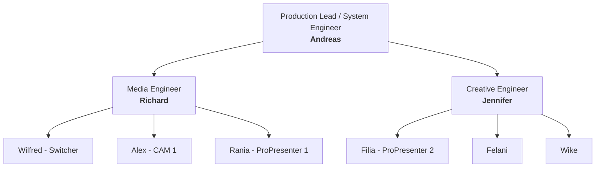
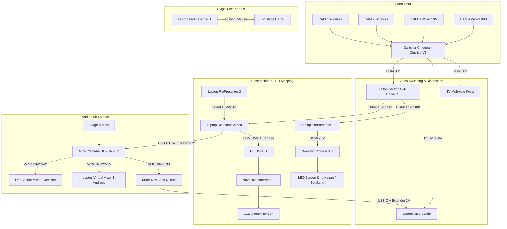

# 🎥 Ibadah Perdana UKK UNNES 2026 — Production & Technical Master Guide

> **Sistem Produksi, Manajemen Inventaris, Routing Audio-Visual, & Distribusi Sinyal Multimedia Ibadah Perdana UKK UNNES 2026.**

---

## 📌 Repository Overview

| Atribut | Keterangan |
| :--- | :--- |
| **Event** | Ibadah Perdana UKK UNNES 2026 |
| **Venue** | Gedung Auditorium Universitas Negeri Semarang (UNNES) |
| **Organizer** | Panitia Ibadah Perdana UKK UNNES 2026 |
| **License** | **Private License** (Internal Production & Technical Team Use Only) |
| **Repository Topics** | `live-production`, `broadcast-system`, `multimedia`, `resolume-arena`, `propresenter`, `obs-studio`, `audio-engineering`, `video-routing`, `ukk-unnes` |

### 📝 Short Description (About)
> *Master documentation & technical pipeline for IP26 Live Broadcast & Multimedia Production at Auditorium UNNES — covering camera routing, audio sub-mixing, LED video processing, inventory tracking, and rundown execution.*

---

## 👥 Tim & Struktur Produksi



### 1. System Engineer (Pelayan)
- **Andreas** (Leader / System Architect)

### 2. Media Engineer (Panitia)
- **Richard** (Leader)
- **Wilfred**
- **Alex**
- **Rania**

### 3. Creative Engineer (Panitia)
- **Jennifer** (Leader)
- **Filia**
- **Felani**
- **Wike**

> [!NOTE]
> **Aturan Penugasan & Peran:**
> - Panitia dapat bertindak sebagai pelayan.
> - Pelayan belum tentu bagian dari struktur kepanitiaan.
> - PIC ada yang berstatus panitia dan ada yang pelayan.
> - PIC yang bukan panitia secara fungsional adalah pelayan teknis.

---

## 🎥 Camera Systems & Routing

### A. Broadcast Camera System (Terhubung ke Master Engine)
*Status Verifikasi: ✅ Terverifikasi Penuh*

| Kamera | Mode | Spesifikasi & Rantai Perangkat (*Routing*) | PIC / Operator | Status |
| :--- | :--- | :--- | :--- | :---: |
| **CAM 1** | Wireless + Steady | Sony ZV-E10 (Kiel 1) + Lensa 18-105mm (OWL) + Baterai (Kiel 1) + SD Card 64GB (Kiel 1) + Tripod Big (OWL) + Micro HDMI to HDMI 30cm (OWL) + **Hollyland Pyro S TX/RX** (OWL) + 2x Baterai WIR (OWL) + Stand Lighting (UKK) + HDMI 1.5M (UKK) $\rightarrow$ Cinetreak Cinelive V1 (OWL) | **Alex** | ✅ |
| **CAM 2** | Wireless + Mobile | Sony ZV-E10 (OWL) + Lensa 18-105mm (OWL) + Baterai (OWL) + SD Card 32GB (OWL) + Micro HDMI to HDMI 30cm (OWL) + **Hollyland Pyro H TX/RX** (OWL) + 2x Baterai WIR (OWL) + Stand Lighting (UKK) + HDMI 1.5M (UKK) $\rightarrow$ Cinetreak Cinelive V1 (OWL) | **Kiel 1** | ✅ |
| **CAM 3** | Wired + Steady | Sony A6000 (OWL) + Lensa 18-105mm (OWL) + Baterai (OWL) + SD Card 32GB (OWL) + Tripod Big (GIA) + Converter Micro HDMI (OWL) + **Kabel HDMI 10M (GKJ)** $\rightarrow$ Cinetreak Cinelive V1 (OWL) | **Nia** | ✅ |
| **CAM 4** | Wired + Steady | Sony A6000 (OWL) + Lensa 16-50mm Kit (Kiel 1) + Baterai (OWL) + SD Card 32GB (OWL) + Tripod Big (UKK) + Converter Micro HDMI (OWL) + **Kabel HDMI 10M (UKK)** $\rightarrow$ Cinetreak Cinelive V1 (OWL) | **Ferdy** | ✅ |
| **BACKUP** | Spare Parts | 2x Converter Micro HDMI to HDMI (Panitia) | - | ✅ |

### B. Documentation Camera System (Terpisah / Standalone)
*Status Verifikasi: ✅ Terverifikasi Penuh*

| Fungsi | Perangkat | PIC / Operator | Status |
| :--- | :--- | :--- | :---: |
| **CAM PHO** (Foto) | Sony A6400 (OWL) + Lensa Sony 50mm (OWL) + 2x Baterai (OWL) + SD Card 32GB (OWL) | **Nico** | ✅ |
| **CAM VID** (Video) | Sony A6600 (Joel) + Lensa Zeiss 24-70mm (Joel) + 2x Baterai (Joel) + SD Card 64GB (Joel) + Gimbal DJI Ronin RS3 (Joel) | **Joel** | ✅ |
| **CAM HP** (Mobile) | iPhone 15 (Jennifer) | **Jennifer** | ✅ |

---

## 🎛️ Master Engine & AV Signal Flow



### 1. Electrical & Power Routing
- **Jalur Terminal Utama:** `Terminal Cable XCH (Andreas)` + `Terminal Cable XCH (UKK)` + `Terminal Cable XCH (Panitia)` terdistribusi ke seluruh meja kontrol (Broadcast, Visual/Lighting, Audio, dan Stage).

### 2. Video Distribution Routing
- **Switcher Multiview:** `Cinetreak V1 (OWL)` $\rightarrow$ `HDMI 1M (GIA)` $\rightarrow$ `Television (Kezia)`
- **Switcher Output Splitter:** `Cinetreak V1 (OWL)` $\rightarrow$ `HDMI 1M (GIA)` $\rightarrow$ `HDMI Splitter 4CH (UKK/GKJ)`
- **Broadcast Feed (OBS):** `Cinetreak V1 (OWL)` $\rightarrow$ `USB-A to USB-C Data Cable (Andreas)` $\rightarrow$ `Laptop (OBS Studio)`
- **Visual Samping & Belakang:** `HDMI Splitter 4CH` $\rightarrow$ `HDMI 1.5M (Andreas)` $\rightarrow$ `HDMI Capture (OWL)` $\rightarrow$ `Laptop ProPresenter 1` $\rightarrow$ `HDMI 20M (UNNES)` $\rightarrow$ `Novastar Processor (UNNES)` $\rightarrow$ **LED Left / Right / Back**
- **Visual Tengah (P2 & Switcher ke Resolume):** 
  - `ProPresenter 2` $\rightarrow$ `HDMI 1.5M (Andreas)` $\rightarrow$ `HDMI Capture (OWL)` $\rightarrow$ `Laptop Resolume Arena`
  - `HDMI Splitter 4CH` $\rightarrow$ `HDMI 1.5M (Andreas)` $\rightarrow$ `HDMI Capture (ABON)` $\rightarrow$ `Laptop Resolume Arena`
  - `Laptop Resolume Arena` $\rightarrow$ `HDMI 15M (GKJ)` $\rightarrow$ `HDMI Capture (GKJ)` $\rightarrow$ `PC (UNNES)` $\rightarrow$ `Novastar Processor (UNNES)` $\rightarrow$ **LED Center**

### 3. Audio Distribution Routing
- **Master Audio to Stream:** `Mixer Yamaha QL5 (UNNES)` $\rightarrow$ `2x XLR 10M (UKK)` + `2x XLR 3M (GIA)` $\rightarrow$ `Mixer NewBaxs CT80S (GIA)` $\rightarrow$ `USB-A Extender 2M (Andreas)` + `USB Data Cable (GIA)` $\rightarrow$ `Laptop (OBS Studio)`
- **BGM / Video Audio Feed:** `Laptop Resolume Arena` $\rightarrow$ `USB-C DAC Hanason AB17X / Oraimo OAA310 (Andreas)` $\rightarrow$ `Audio Cable 20M (UNNES)` $\rightarrow$ `Mixer Yamaha QL5 (UNNES)`
- **Remote / Virtual Mixing:** `Mixer Yamaha QL5 (UNNES)` $\rightarrow$ `WiFi (UNNES-ID)` $\rightarrow$ `Laptop VM1 (Andreas)` & `iPad VM2 (Jennifer)`

### 4. Stage Time Keeper Routing
- `Laptop ProPresenter 3` $\rightarrow$ `HDMI 1.5M (Lio)` $\rightarrow$ `Television (Darrel)` + `Terminal Cable (UKK)`

---

## 💻 Media System Devices & Operator Matrix

| Device / Workstation | Hardware & Owner | Operator / PIC | Status |
| :--- | :--- | :--- | :---: |
| **Mixer 1 (FOH)** | Mixer Yamaha QL5 (UNNES) | **Jordan / Yosua** | ✅ |
| **Mixer 2 (Stream Audio)**| Mixer NewBaxs CT80S (GIA) | **Andreas** | ✅ |
| **Virtual Mixer 1** | Laptop + Adaptor (Andreas) | **Jordan / Yosua** | ✅ |
| **Virtual Mixer 2** | iPad (Jennifer) | **Jordan / Yosua** | ✅ |
| **Resolume Arena** | Laptop + Adaptor (Bayu) | **Andreas** | ✅ |
| **ProPresenter 1** | Laptop + Adaptor (*Belum Ada*) | **Rania** | ⚠️ *Belum Ada* |
| **ProPresenter 2** | Laptop + Adaptor (*Belum Ada*) | **Filia** | ⚠️ *Belum Ada* |
| **ProPresenter 3 + TV** | Laptop (*Belum Ada*) + TV (Darrel) | **Tim Acara** | ⚠️ *Belum Ada* |
| **Switcher + TV** | Cinetreak V1 (OWL) + TV (Kezia) | **Wilfred** | ✅ |
| **OBS Studio Live** | Laptop + Adaptor (*Belum Ada*) | **Andreas** | ⚠️ *Belum Ada* |
| **Backup Laptop** | Laptop + Adaptor (Kiel 1) | **Kiel 1** | ✅ |

---

## 📦 Master Inventory & Storage Checklist

*Keterangan Status:*
- ✅ = Terpakai & terpasang di sistem/wiring
- ⚠️ = Terpakai sebagian (contoh: 2/4 unit) atau menunggu unit
- ☑️ = Standby / Cadangan siap pakai

<details>
<summary><b>1. Peminjaman dari OWL (Klik untuk melihat detail)</b></summary>

- Sony A6000 (2 Unit) ✅
- Sony A6400 (1 Unit) ✅
- Sony ZV-E10 (1 Unit) ✅
- Lensa 18-105mm (3 Unit) ✅
- Lensa 50mm (1 Unit) ✅
- Baterai Kamera (8 Unit) ✅ *(5 terpakai, 3 standby)*
- Charger Kamera (1 Pack) ✅
- Memory Card 32GB (4 Unit) ✅
- Cinetreak Cinelive V1 (1 Pack) ✅
- Power Adaptor MIX (1 Unit) ✅
- Hollyland Pyro H (1 Pack TX/RX) ✅
- Hollyland Pyro S (1 Pack TX/RX) ✅
- Baterai WIR (4 Unit) ✅
- Tripod Camera Big (1 Unit) ✅
- Micro HDMI to HDMI Converter (2 Unit) ✅
- HDMI to Micro HDMI Cable 30cm (2 Unit) ✅
- HDMI Capture (2 Unit) ✅
</details>

<details>
<summary><b>2. Peminjaman dari ABON</b></summary>

- HDMI Capture (2 Unit) ⚠️ *1 terpakai di Resolume LED Center, 1 standby*
</details>

<details>
<summary><b>3. Peminjaman dari Andreas</b></summary>

- Fan Cooler (1 Unit) ☑️
- Mouse Pad (1 Unit) ☑️
- Keyboard Ext (1 Unit) ☑️
- Mouse Ext (1 Unit) ☑️
- Powerbank (1 Unit) ☑️
- Power Adaptor USB-A (9 Unit) ☑️
- Power Adaptor USB-A x C (1 Unit) ☑️
- Power Adaptor USB-C (1 Unit) ☑️
- USB-A to USB-B Data Cable (1 Unit) ☑️
- USB-A to Micro USB Data Cable (2 Unit) ☑️
- USB-A to USB-C Data Cable (1 Unit) ✅
- USB-A to USB-C Charge Cable (1 Unit) ☑️
- USB-C to USB-C Charge Cable (1 Unit) ☑️
- USB-A to USB-A Extender 30cm (2 Unit) ☑️
- USB-A to USB-A Extender 2M (1 Unit) ✅
- USB-A to USB-C Male Converter (4 Unit) ☑️
- USB-A to USB-C Female Converter (2 Unit) ☑️
- USB-A to Mini USB Cable (1 Unit) ☑️
- USB-A Splitter 3CH (1 Unit) ☑️
- USB-A Splitter 4CH (1 Unit) ☑️
- USB-C DAC Hanason AB17X (1 Unit) ✅
- USB-C DAC Oraimo OAA310 (1 Unit) ☑️
- In-Ear Monitor QKZ Hi7T (1 Pack) ☑️
- In-Ear Monitor KZ EDX Pro (1 Pack) ☑️
- Fastdrive V-Gen SSD 128GB (1 Pack) ☑️
- Fastdrive Toshiba HDD 1TB (1 Pack) ☑️
- Flashdrive 8GB / 16GB / 32GB / 64GB (4 Unit) ☑️
- HDMI to Mini HDMI Converter (1 Unit) ☑️
- Mini HDMI to Mini HDMI Cable 1.5M (1 Unit) ☑️
- HDMI to HDMI Cable 1.5M (3 Unit) ✅
- VGA to HDMI Converter (3 Unit) ☑️
- VGA to VGA Cable 1.5M (1 Unit) ☑️
- Power Cable 3-PIN (3 Unit) ⚠️
- Power Cable 2-PIN (1 Unit) ⚠️
- Terminal Cable 4CH (3 Unit), 3CH (2 Unit), 2CH (1 Unit) ⚠️
- Terminal Cable XCH (X Unit) ✅
- Terminal T (8 Unit) ⚠️
- Addon / Jack / Screw / Ties / Tape Box (5 Pack) ☑️
- Tool Box (2 Pack) ☑️
- Cable Box (1 Pack) ☑️
</details>

<details>
<summary><b>4. Peminjaman dari GIA Deliksari</b></summary>

- Mixer NewBaxs CT80S (1 Unit) ✅
- XLR Female to Male Cable 3M (2 Unit) ✅
- USB-A to USB-C Data Cable (1 Unit) ✅
- Tripod Camera Big (1 Unit) ✅
- HDMI Splitter 2CH (1 Unit) ☑️
- Power Adaptor SPL (1 Pack) ☑️
- HDMI to HDMI Cable 1M (2 Unit) ✅
</details>

<details>
<summary><b>5. Peminjaman dari GKJ Ngaliyan</b></summary>

- Stand Lighting Small (1 Unit) ☑️
- HDMI Cable 15M (1 Unit) ✅
- HDMI Cable 10M (1 Unit) ✅
- HDMI Cable 5M (1 Unit) ☑️
- HDMI Cable 1.5M (1 Unit) ☑️
- HDMI Capture (1 Unit) ✅
- HDMI Splitter 4CH (1 Unit) ☑️
- Power Adaptor SPL (1 Pack) ☑️
</details>

<details>
<summary><b>6. Peminjaman dari UKK UNNES</b></summary>

- XLR Female to Male Cable 10M (3 Unit) ⚠️ *(2 terpakai, 1 standby)*
- Stand Lighting Small (4 Unit) ⚠️ *(2 terpakai, 2 standby)*
- Tripod Camera Big (1 Unit) ✅
- HDMI to Mini HDMI Cable 2.5M (1 Unit) ☑️
- HDMI Cable 15M (1 Unit) ☑️
- HDMI Cable 10M (1 Unit) ✅
- HDMI Cable 1.5M (4 Unit) ⚠️ *(2 terpakai, 2 standby)*
- HDMI Splitter 4CH + Adaptor (1 Unit) ✅
- VGA to VGA Cable 1.5M & 2.5M (2 Unit) ☑️
- VGA to HDMI Converter (2 Unit) ☑️
- Power Cable X-PIN (X Unit) ☑️
- Terminal Cable XCH (X Unit) ✅
</details>

<details>
<summary><b>7. Peminjaman dari Personal & Panitia</b></summary>

- **Lio:** HDMI Cable 1.5M (1 Unit) ✅
- **Darrel:** Television + Power Adaptor (1 Unit) ✅, SD Card 8GB (1 Unit) ☑️
- **Kiel 1:** Sony ZV-E10 (1 Unit) ✅, Lensa Kit 16-50mm (1 Unit) ✅, Lensa Fix 50mm (1 Unit) ☑️, Baterai & Charger (1 Pack) ✅, SD Card 64GB (1 Unit) ✅, SD Card 128GB (1 Unit) ☑️
- **Joel:** Sony A6600 (1 Unit) ✅, Lensa Zeiss 24-70mm (1 Unit) ✅, 2x Baterai & Charger (1 Pack) ✅, SD Card 64GB (1 Unit) ✅, Gimbal DJI Ronin RS3 (1 Unit) ✅
- **Kezia:** Television + Power Adaptor (1 Unit) ✅
- **Jennifer:** iPhone 15 (1 Unit) ✅, iPad (1 Unit) ✅
- **Bayu:** Laptop Resolume Arena + Adaptor (1 Unit) ✅
- **Panitia:** 2x Micro HDMI Converter ✅, Terminal Cable XCH ✅
</details>

---

## 📋 Rundown & Visual Asset Placement

| Sesi | Item Materi / Konten | Output Target |
| :--- | :--- | :--- |
| **Pre-Ibadah**<br>*(Open Gate)* | • Playlist Lagu Rohani<br>• Loop Video (Profile UKK, After Movie IP25 & IN25) | Sound System FOH<br>LED Screen Tengah |
| **Main Ibadah**<br>*(Main Event)* | • Video Opening<br>• Video Sambutan Bu Grace<br>• Background Tema<br>• Background Lagu<br>• Lirik Lagu Pujian/Penyembahan<br>• Video Generation<br>• PPT Pembicara<br>• Ayat & Quote Pembicara<br>• Slide Persembahan (QRIS)<br>• UKK News<br>• Pokok Doa Bersama | LED Tengah<br>LED Tengah, Kiri & Kanan<br>LED Tengah<br>Sound System FOH<br>LED Tengah, Kiri & Kanan<br>LED Tengah, Kiri & Kanan<br>LED Tengah, Kiri & Kanan<br>LED Tengah, Kiri & Kanan<br>LED Tengah, Kiri & Kanan<br>LED Tengah, Kiri & Kanan<br>LED Tengah, Kiri & Kanan |
| **Post-Ibadah**<br>*(Close Gate)* | • Usung-usung, Rolling Kabel, & Inventory Re-Check | Semua Tim Teknis & Panitia |

---

## 🔒 License

```text
PROPRIETARY & CONFIDENTIAL
Copyright (c) 2026 Panitia Ibadah Perdana UKK UNNES & Technical Production Team.

All rights reserved. This repository, including system diagrams, routing logic,
and production configurations, is private and intended solely for authorized
personnel and technical crews of UKK UNNES.
```
