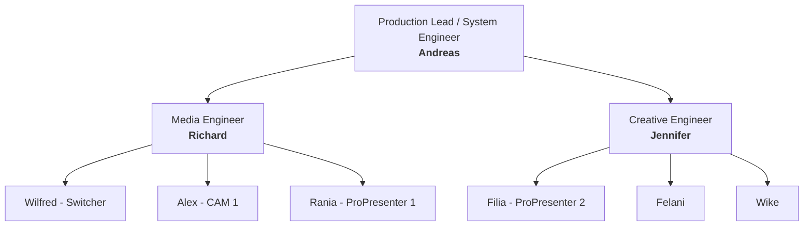
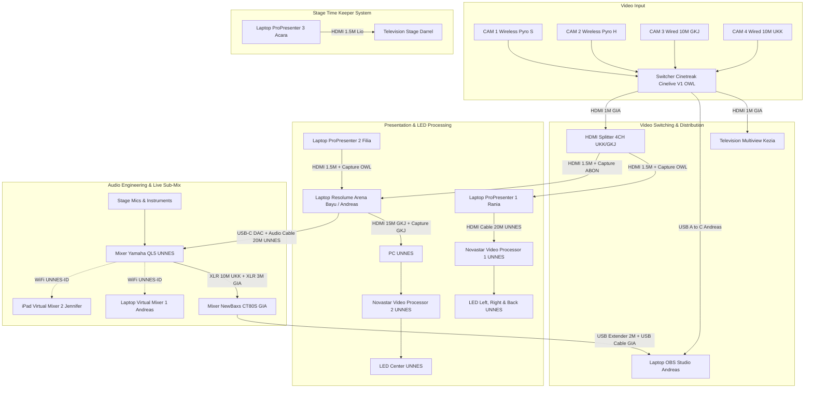

# 🎥 Ibadah Perdana UKK UNNES 2026 — Production & Technical Master Guide

<div align="center">

[](#)
[](#)
[](#)
[](./LICENSE)

<br/>

[](#)
[](#)
[](#)
[](#)
[](#)
[](#)
[](#)
[](#)

</div>

> **Dokumentasi Utama Sistem Produksi, Manajemen Inventaris, Routing Audio-Visual, & Distribusi Sinyal Multimedia Ibadah Perdana UKK UNNES 2026.**

---

## 📌 Repository Overview

| Atribut | Keterangan |
| :--- | :--- |
| **Event** | Ibadah Perdana UKK UNNES 2026 |
| **Venue** | Gedung Auditorium Universitas Negeri Semarang (UNNES) |
| **Organizer / Production** | Panitia Ibadah Perdana 2026 |
| **License** | **Private & Confidential** (Internal Production & Technical Team Use Only) |
| **Repository Topics** | `live-production`, `broadcast-system`, `multimedia`, `resolume-arena`, `propresenter`, `obs-studio`, `audio-engineering`, `video-routing`, `ukk-unnes`, `live-streaming` |

### 📝 Short Description (About)
> *Master documentation & technical pipeline for IP26 Live Broadcast & Multimedia Production at Auditorium UNNES — covering camera routing, audio sub-mixing, LED video processing, inventory tracking, and rundown execution.*

---

## 👥 Tim & Struktur Organisasi Produksi



### 1. System Engineer (Pelayan)
- **Andreas** (Leader / System Architect)

### 2. Media Engineer (Panitia)
- **Richard** (Leader)
- **Wilfred**
- **Alex**
- **Rania**

### 3. Creative Engineer (Panitia)
- **Jennifer** (Leader)
- **Filia**
- **Felani**
- **Wike**

> [!NOTE]
> **Prinsip & Aturan Penugasan Tim:**
> - Panitia bisa bertindak sebagai pelayan teknis.
> - Pelayan belum tentu bagian dari panitia struktural.
> - PIC ada yang berstatus panitia dan ada yang berstatus pelayan.
> - PIC yang bukan panitia secara fungsional adalah pelayan teknis.
> - PIC dan Pelayan memiliki tanggung jawab teknis yang setara di lapangan.

---

## 🎥 Camera Systems & Routing Detail

### A. Broadcast Camera System (Terintegrasi ke Master Engine)
*Catatan: Terverifikasi Penuh (✅) & Terhubung Langsung ke Switcher Utama Cinetreak Cinelive V1.*

| Kamera | Mode Operasi | Rantai Perangkat & Routing Sinyal (*Hardware Path*) | PIC / Operator | Status |
| :--- | :--- | :--- | :--- | :---: |
| **CAM 1** | Wireless + Steady | Sony ZVE10 (Kiel 1) + Lensa 18-105MM (OWL) + Battery (Kiel 1) + Memory Card 64GB (Kiel 1) + Tripod Camera Big (OWL) + HDMI to Micro HDMI Cable 30CM (OWL) + **Hollyland Pyro S TX** (OWL) + Battery WIR (OWL) $\xrightarrow{\text{Wireless}}$ **Hollyland Pyro S RX** (OWL) + Battery WIR (OWL) + Stand Lighting Small (UKK) + HDMI Cable 1,5M (UKK) $\rightarrow$ Cinetreak Cinelive V1 (OWL) | **Alex** | ✅ |
| **CAM 2** | Wireless + Mobile | Sony ZV-E10 (OWL) + Lensa 18-105MM (OWL) + Battery (OWL) + Memory Card 32GB (OWL) + HDMI to Micro HDMI Cable 30CM (OWL) + **Hollyland Pyro H TX** (OWL) + Battery WIR (OWL) $\xrightarrow{\text{Wireless}}$ **Hollyland Pyro H RX** (OWL) + Battery WIR (OWL) + Stand Lighting Small (UKK) + HDMI Cable 1,5M (UKK) $\rightarrow$ Cinetreak Cinelive V1 (OWL) | **Kiel 1** | ✅ |
| **CAM 3** | Wired + Steady | Sony A6000 (OWL) + Lensa 18-105MM (OWL) + Battery (OWL) + Memory Card 32GB (OWL) + Tripod Camera Big (GIA) + Micro HDMI to HDMI Converter (OWL) + **HDMI Cable 10M (GKJ)** $\rightarrow$ Cinetreak Cinelive V1 (OWL) | **Nia** | ✅ |
| **CAM 4** | Wired + Steady | Sony A6000 (OWL) + Lensa 16-50MM Kit (Kiel 1) + Battery (OWL) + Memory Card 32GB (OWL) + Tripod Camera Big (UKK) + Micro HDMI to HDMI Converter (OWL) + **HDMI Cable 10M (UKK)** $\rightarrow$ Cinetreak Cinelive V1 (OWL) | **Ferdy** | ✅ |
| **BACKUP** | Spare Parts | 2x Micro HDMI to HDMI Converter (Panitia) | - | ✅ |

### B. Documentation Camera System (Terpisah / Standalone)
*Catatan: Terpisah dari Broadcast System dan Engine System untuk keperluan dokumentasi foto, aftermovie, dan media sosial.*

| Fungsi | Rantai Perangkat (*Hardware Path*) | PIC / Operator | Status |
| :--- | :--- | :--- | :---: |
| **CAM PHO (Foto)** | Sony A6400 (OWL) + Lensa Sony 50MM (OWL) + Battery X2 (OWL) + Memory Card 32GB (OWL) | **Nico** | ✅ |
| **CAM VID (Video)** | Sony A6600 (Joel) + Lensa 24-70MM Zeiss (Joel) + Battery X2 (Joel) + Memory Card 64GB (Joel) + Gimbal DJI Ronin RS3 (Joel) | **Joel** | ✅ |
| **CAM HP (Mobile)** | iPhone 15 (Jennifer) | **Jennifer** | ✅ |

---

## 🎛️ Master Engine & AV Signal Flow Architecture



---

## 🔌 Detail Spesifikasi Routing Engine

### 1. Electrical Routing (Power Distribution)
- `Terminal Cable XCH (Andreas)` + `Terminal Cable XCH (UKK)` + `Terminal Cable XCH (Panitia)`
- Distribusi daya menyeluruh untuk meja kontrol Broadcast, Audio FOH, Multimedia/Visual LED, dan Panggung.

### 2. Video Broadcast & LED Routing
- **Switcher + Television (Multiview):** `Terminal Cable XCH (UKK)` + `Cinetreak Cinelive V1 (OWL)` + `Power Adaptor MIX (OWL)` + `HDMI to HDMI Cable 1M (GIA)` + `Television (Kezia)` + `Power Adaptor TV (Kezia)` ✅
- **Switcher + Splitter (Master Feed Distribution):** `Terminal Cable XCH (UKK)` + `Cinetreak Cinelive V1 (OWL)` + `Power Adaptor MIX (OWL)` + `HDMI to HDMI Cable 1M (GIA)` + `HDMI Splitter 4CH (UKK/GKJ)` + `Power Adaptor SPL (UKK/GKJ)` ✅
- **Switcher + OBS (Live Streaming Program Feed):** `Terminal Cable XCH (UKK)` + `Cinetreak Cinelive V1 (OWL)` + `Power Adaptor MIX (OWL)` + `USB A to USB C Data Cable (Andreas)` + `Laptop (OBS Studio)` + `Power Adaptor LTP (OBS Studio)` ✅
- **Splitter + PRO1 + LED Left Right Back:** `HDMI Splitter 4CH (UKK/GKJ)` + `Power Adaptor SPL (UKK/GKJ)` + `HDMI to HDMI Cable 1,5M (Andreas)` + `HDMI Capture (OWL)` + `Laptop (Pro Presenter 1)` + `Power Adaptor LTP (Pro Presenter 1)` + `HDMI Cable 20M (UNNES)` + `Novastar Video Processor (UNNES)` + `LED Left Right Back (UNNES)` ✅
- **PRO2 + RES (Graphics/Lyrics to Visual Mapper):** `Laptop (Pro Presenter 2)` + `Power Adaptor LTP (Pro Presenter 2)` + `HDMI to HDMI Cable 1,5M (Andreas)` + `HDMI Capture (OWL)` + `Laptop (Resolume Arena)` + `Power Adaptor LTP (Resolume Arena)` ✅
- **Splitter + RES + LED Center (Main Stage Visual):** `HDMI Splitter 4CH (UKK/GKJ)` + `Power Adaptor SPL (UKK/GKJ)` + `HDMI to HDMI Cable 1,5M (Andreas)` + `HDMI Capture (ABON)` + `Laptop (Resolume Arena)` + `Power Adaptor LTP` + `HDMI Cable 15M (GKJ)` + `HDMI Capture (GKJ)` + `PC (UNNES)` + `Novastar Video Processor (UNNES)` + `LED Center (UNNES)` ✅

### 3. Audio Sub-System Routing
- **Mixer 1 + XLR Cable + Mixer 2 + OBS (Broadcast Sub-Mix):** `Mixer Yamaha QL5 (UNNES)` + `XLR Female to Male Cable 10M 2X (UKK)` + `XLR Female to Male Cable 3M 2X (GIA)` + `Mixer NewBaxs CT80S (GIA)` + `USB A to USB A Extender 2M (Andreas)` + `USB A to USB C Data Cable (GIA)` + `Laptop (OBS Studio)` + `Power Adaptor LTP (OBS Studio)` ✅
- **RES + DAC + Mixer 1 (BGM / Video Playback Audio):** `Laptop (Resolume Arena)` + `Power Adaptor LTP (Resolume Arena)` + `USB C DAC Hanason AB17X / USB C DAC Oraimo OAA310 (Andreas)` + `Audio Cable 20M (UNNES)` + `Mixer Yamaha QL5 (UNNES)` ✅
- **Mixer 1 + VM1 (FOH Remote 1):** `Mixer Yamaha QL5 (UNNES)` + `WiFi (UNNES-ID)` + `Laptop (Virtual Mixer 1)` + `Power Adaptor LTP (Virtual Mixer 1)` ✅
- **Mixer 1 + VM2 (FOH Remote 2):** `Mixer Yamaha QL5 (UNNES)` + `WiFi (UNNES-ID)` + `iPad (Virtual Mixer 2)` ✅

### 4. Stage Time Keeper System
- **PRO3 + Television (Stage Monitor Waktu):** `Terminal Cable XCH (UKK)` + `Laptop (Pro Presenter 3)` + `Power Adaptor LTP (Pro Presenter 3)` + `HDMI to HDMI Cable 1.5M (Lio)` + `Television (Darrel)` + `Power Adaptor TV (Darrel)` ✅ *(Sistem terpisah independen)*

### 5. Catatan Redundansi Splitter
> [!TIP]
> **Cadangan HDMI Splitter:**
> Tersedia 3 unit HDMI Splitter siap pakai:
> - GKJ Ngaliyan: 1 Unit HDMI Splitter 4CH + Adaptor
> - UKK UNNES: 1 Unit HDMI Splitter 4CH + Adaptor
> - GIA Deliksari: 1 Unit HDMI Splitter 2CH + Adaptor
> 
> *Sistem utama menggunakan 1 unit Splitter 4CH, menyisakan 2 unit HDMI Splitter sebagai unit backup instan.*

---

## 💻 Media System Device & Operator Matrix

| Device / Workstation | Alokasi Hardware | Operator / PIC | Status Verifikasi |
| :--- | :--- | :--- | :---: |
| **Mixer 1 (FOH Master)** | Yamaha QL5 (UNNES) | **Jordan / Yosua** | ✅ Terverifikasi |
| **Mixer 2 (Streaming Sub-Mix)** | NewBaxs CT80S (GIA) | **Andreas** | ✅ Terverifikasi |
| **Virtual Mixer 1** | Laptop + Power Adaptor LTP (Andreas) | **Jordan / Yosua** | ✅ Terverifikasi |
| **Virtual Mixer 2** | iPad (Jennifer) | **Jordan / Yosua** | ✅ Terverifikasi |
| **Resolume Arena** | Laptop + Power Adaptor LTP (Bayu) | **Andreas** | ✅ Terverifikasi |
| **Pro Presenter 1 (Side & Back LED)** | Laptop + Power Adaptor LTP (*Belum Ada*) | **Rania** | ⚠️ *Belum Ada Laptop* |
| **Pro Presenter 2 (Center Lyrics/Layer)** | Laptop + Power Adaptor LTP (*Belum Ada*) | **Filia** | ⚠️ *Belum Ada Laptop* |
| **Pro Presenter 3 + Television (Time Keeper)** | Laptop X (*Belum Ada*) + TV & Adaptor (Darrel) | **Tim Acara** | ⚠️ *Belum Ada Laptop* |
| **Switcher + Television (Multiview)** | Cinetreak Cinelive V1 (OWL) + TV (Kezia) | **Wilfred** | ✅ Terverifikasi |
| **OBS Studio (Live Stream Control)** | Laptop X + Power Adaptor LTP (*Belum Ada*) | **Andreas** | ⚠️ *Belum Ada Laptop* |
| **Backup Laptop** | Laptop + Power Adaptor LTP (Kiel 1) | **Kiel 1** | ✅ Standby Terverifikasi |

---

## 📦 Master Inventory & Equipment List (Full Expanded)

*Keterangan Status Inventaris:*
- `✅` = Terpakai & terpasang aktif di sistem / wiring / routing
- `⚠️` = Terpakai sebagian (contoh: 2 dari 4 unit) atau menunggu pemenuhan unit
- `☑️` = Standby / Cadangan siap pakai di storage box

---

### 1. Peminjaman dari OWL
| Nama Barang | Jumlah | Status | Keterangan Penggunaan |
| :--- | :---: | :---: | :--- |
| Sony A6000 | 2 Unit | ✅ | CAM 3 & CAM 4 Broadcast |
| Sony A6400 | 1 Unit | ✅ | CAM PHO Dokumentasi Foto |
| Sony ZV-E10 | 1 Unit | ✅ | CAM 2 Broadcast Wireless |
| Lens 18-105MM | 3 Unit | ✅ | CAM 1, CAM 2, & CAM 3 |
| Lens 50MM | 1 Unit | ✅ | CAM PHO Dokumentasi Foto |
| Battery Kamera | 8 Unit | ✅ | 5 Unit terpakai aktif (CAM 2, 3, 4 & PHO x2), 3 Unit standby |
| Charger Kamera | 1 Pack | ✅ | Station pengisian daya baterai kamera |
| Memory Card 32GB | 4 Unit | ✅ | CAM 2, CAM 3, CAM 4, dan CAM PHO |
| Cinetreak Cinelive V1 | 1 Pack | ✅ | Video Switcher Master Broadcast |
| Power Adaptor MIX | 1 Unit | ✅ | Power Adaptor Cinetreak Cinelive V1 |
| Hollyland Pyro H | 1 Pack | ✅ | TX & RX Wireless CAM 2 Mobile |
| Hollyland Pyro S | 1 Pack | ✅ | TX & RX Wireless CAM 1 Steady |
| Battery WIR | 4 Unit | ✅ | 2 Unit Pyro S (TX/RX), 2 Unit Pyro H (TX/RX) |
| Tripod Camera Big | 1 Unit | ✅ | Tripod CAM 1 Broadcast |
| HDMI to Micro HDMI Converter | 2 Unit | ✅ | Converter CAM 3 & CAM 4 |
| HDMI to Micro HDMI Cable 30CM | 2 Unit | ✅ | CAM 1 & CAM 2 ke Hollyland TX |
| HDMI Capture | 2 Unit | ✅ | 1x Input ProPresenter 1, 1x Input Resolume dari ProPresenter 2 |

---

### 2. Peminjaman dari ABON
| Nama Barang | Jumlah | Status | Keterangan Penggunaan |
| :--- | :---: | :---: | :--- |
| HDMI Capture | 2 Unit | ⚠️ 1/2 | 1 Unit terpakai di Input Resolume (Splitter $\rightarrow$ RES), 1 Unit standby |

---

### 3. Peminjaman dari Andreas
| Nama Barang | Jumlah | Status | Keterangan Penggunaan |
| :--- | :---: | :---: | :--- |
| Fan Cooler | 1 Unit | ☑️ | Pendingin laptop / workstation |
| Mouse Pad | 1 Unit | ☑️ | Perlengkapan workstation |
| Keyboard External | 1 Unit | ☑️ | Kontrol tambahan |
| Mouse External | 1 Unit | ☑️ | Kontrol navigasi switcher / visual |
| Powerbank | 1 Unit | ☑️ | Daya darurat |
| Power Adaptor USB A | 9 Unit | ☑️ | Charger aksesoris / transmitter |
| Power Adaptor USB A x C | 1 Unit | ☑️ | Charger cepat dual-port |
| Power Adaptor USB C | 1 Unit | ☑️ | Charger perangkat Type-C |
| USB A to USB B Data Cable | 1 Unit | ☑️ | Cadangan koneksi printer/audio device |
| USB A to USB Micro B Data Cable | 2 Unit | ☑️ | Cadangan koneksi perangkat legacy |
| USB A to USB C Data Cable | 1 Unit | ✅ | Switcher Cinetreak $\rightarrow$ Laptop OBS Studio |
| USB A to USB C Charge Cable | 1 Unit | ☑️ | Pengisian daya |
| USB C to USB C Charge Cable | 1 Unit | ☑️ | Pengisian daya Type-C |
| USB A to USB A Extender 30CM | 2 Unit | ☑️ | Sambungan pendek port USB |
| USB A to USB A Extender 2M | 1 Unit | ✅ | Mixer NewBaxs CT80S $\rightarrow$ Laptop OBS Studio |
| USB A to USB C Male Converter | 4 Unit | ☑️ | Converter port USB-C |
| USB A to USB C Female Converter | 2 Unit | ☑️ | Adapter USB-C |
| USB A to Mini USB Cable | 1 Unit | ☑️ | Cadangan koneksi perangkat mini-USB |
| USB A Splitter 3CH | 1 Unit | ☑️ | Ekspansi port USB |
| USB A Splitter 4CH | 1 Unit | ☑️ | Ekspansi port USB |
| USB C DAC Hanason AB17X | 1 Unit | ✅ | Audio DAC Laptop Resolume $\rightarrow$ Mixer Yamaha QL5 |
| USB C DAC Oraimo OAA310 | 1 Unit | ☑️ | Cadangan Audio DAC |
| In Ear Monitor QKZ Hi7T | 1 Pack | ☑️ | Monitoring audio operator |
| In Ear Monitor KZ EDX Pro | 1 Pack | ☑️ | Monitoring audio operator |
| Fastdrive Vgen SSD 128GB | 1 Pack | ☑️ | Penyimpanan cepat materi visual |
| Fastdrive Toshiba HDD 1TB | 1 Pack | ☑️ | Penyimpanan arsip video & asset besar |
| Flashdrive Toshiba 8GB | 1 Unit | ☑️ | Transfer materi presentasi |
| Flashdrive Sandisk 16GB | 1 Unit | ☑️ | Transfer materi presentasi |
| Flashdrive Toshiba 32GB | 1 Unit | ☑️ | Backup materi video / audio |
| Flashdrive Toshiba 64GB | 1 Unit | ☑️ | Backup master file rundown |
| HDMI to Mini HDMI Converter | 1 Unit | ☑️ | Cadangan konverter video |
| Mini HDMI to Mini HDMI Cable 1,5M | 1 Unit | ☑️ | Cadangan kabel video |
| HDMI to HDMI Cable 1,5M | 3 Unit | ✅ | 1x Splitter $\rightarrow$ PRO1, 1x PRO2 $\rightarrow$ RES, 1x Splitter $\rightarrow$ RES |
| VGA to HDMI Converter | 3 Unit | ☑️ | Cadangan display legacy |
| VGA to VGA Cable 1,5M | 1 Unit | ☑️ | Cadangan monitor |
| Power Cable 3PIN | 3 Unit | ⚠️ | Kabel power PC / Monitor / Mixer |
| Power Cable 2PIN | 1 Unit | ⚠️ | Kabel power adaptor TV / Device |
| Terminal Cable 4CH | 3 Unit | ⚠️ | Distribusi colokan meja teknis |
| Terminal Cable 3CH | 2 Unit | ⚠️ | Distribusi colokan meja teknis |
| Terminal Cable 2CH | 1 Unit | ⚠️ | Distribusi colokan meja teknis |
| Terminal Cable XCH | X Unit | ✅ | Terminal utama meja kontrol |
| Terminal T | 8 Unit | ⚠️ | Percabangan colokan listrik |
| Addon Box | 1 Pack | ☑️ | Perlengkapan & tools tambahan |
| Jack Box | 1 Pack | ☑️ | Kumpulan jack audio & converter |
| Screw Box | 1 Pack | ☑️ | Baut rigging & plate kamera/tripod |
| Ties Box | 1 Pack | ☑️ | Cable ties untuk manajemen kabel |
| Tool Box | 2 Pack | ☑️ | Obeng, tang, gunting, tespen, multimeter |
| Cable Box | 1 Pack | ☑️ | Wadah manajemen cadangan kabel |
| Tape Box | 1 Pack | ☑️ | Lakban kain, isolasi hitam, double tape |

---

### 4. Peminjaman dari GIA Deliksari
| Nama Barang | Jumlah | Status | Keterangan Penggunaan |
| :--- | :---: | :---: | :--- |
| Mixer NewBaxs CT80S | 1 Unit | ✅ | Mixer 2 (Sub-Mix Audio Streaming ke OBS) |
| XLR Female to Male Cable 3M | 2 Unit | ✅ | Output Yamaha QL5 $\rightarrow$ Input Mixer NewBaxs CT80S |
| USB A to USB C Data Cable | 1 Unit | ✅ | Mixer NewBaxs CT80S $\rightarrow$ Laptop OBS Studio |
| Tripod Camera Big | 1 Unit | ✅ | Tripod CAM 3 Broadcast |
| HDMI Splitter 2CH | 1 Unit | ☑️ | Cadangan Video Splitter |
| Power Adaptor SPL | 1 Pack | ☑️ | Power Adaptor Splitter GIA |
| HDMI to HDMI Cable 1M | 2 Unit | ✅ | 1x Switcher $\rightarrow$ TV Multiview, 1x Switcher $\rightarrow$ Splitter 4CH |

---

### 5. Peminjaman dari GKJ Ngaliyan
| Nama Barang | Jumlah | Status | Keterangan Penggunaan |
| :--- | :---: | :---: | :--- |
| Stand Lighting Small | 1 Unit | ☑️ | Cadangan stand wireless receiver / lighting |
| HDMI Cable 15M | 1 Unit | ✅ | Output Laptop Resolume $\rightarrow$ HDMI Capture PC UNNES |
| HDMI Cable 10M | 1 Unit | ✅ | CAM 3 Wired $\rightarrow$ Switcher Cinetreak |
| HDMI Cable 5M | 1 Unit | ☑️ | Cadangan kabel HDMI jarak menengah |
| HDMI Cable 1,5M | 1 Unit | ☑️ | Cadangan kabel patch HDMI |
| HDMI Capture | 1 Unit | ✅ | Input ke PC UNNES dari Laptop Resolume |
| HDMI Splitter 4CH | 1 Unit | ☑️ | Cadangan HDMI Splitter 4 Channel |
| Power Adaptor SPL | 1 Pack | ☑️ | Power Adaptor Splitter GKJ |

---

### 6. Peminjaman dari UKK UNNES
| Nama Barang | Jumlah | Status | Keterangan Penggunaan |
| :--- | :---: | :---: | :--- |
| XLR Female to Male Cable 10M | 3 Unit | ⚠️ 2/3 | 2 Unit Yamaha QL5 $\rightarrow$ CT80S, 1 Unit standby |
| Stand Lighting Small | 4 Unit | ⚠️ 2/4 | 1x Holder RX Pyro S (CAM 1), 1x Holder RX Pyro H (CAM 2), 2x standby |
| Tripod Camera Big | 1 Unit | ✅ | Tripod CAM 4 Broadcast |
| HDMI to Mini HDMI Cable 2,5M | 1 Unit | ☑️ | Cadangan kabel video |
| HDMI Cable 15M | 1 Unit | ☑️ | Cadangan kabel HDMI panjang |
| HDMI Cable 10M | 1 Unit | ✅ | CAM 4 Wired $\rightarrow$ Switcher Cinetreak |
| HDMI Cable 1,5M | 4 Unit | ⚠️ 2/4 | 1x Pyro S RX $\rightarrow$ Switcher, 1x Pyro H RX $\rightarrow$ Switcher, 2x standby |
| HDMI Splitter 4CH | 1 Unit | ✅ | Splitter Utama Distribusi Sinyal Switcher |
| Power Adaptor SPL | 1 Pack | ✅ | Power Adaptor Splitter UKK |
| VGA to VGA Cable 1,5M | 1 Unit | ☑️ | Cadangan kabel monitor |
| VGA to VGA Cable 2,5M | 1 Unit | ☑️ | Cadangan kabel monitor |
| VGA to HDMI Converter | 2 Unit | ☑️ | Cadangan converter display |
| Power Cable XPIN | X Unit | ☑️ | Cadangan kabel power |
| Terminal Cable XCH | X Unit | ✅ | Distribusi listrik panggung & FOH |

---

### 7. Peminjaman dari Lio
| Nama Barang | Jumlah | Status | Keterangan Penggunaan |
| :--- | :---: | :---: | :--- |
| HDMI Cable 1,5M | 1 Unit | ✅ | Laptop ProPresenter 3 $\rightarrow$ Television Time Keeper |

---

### 8. Peminjaman dari Darrel
| Nama Barang | Jumlah | Status | Keterangan Penggunaan |
| :--- | :---: | :---: | :--- |
| Television | 1 Unit | ✅ | Monitor Stage Time Keeper |
| Power Adaptor TV | 1 Pack | ✅ | Power Adaptor TV Time Keeper |
| Memory Card 8GB | 1 Unit | ☑️ | Penyimpanan file cadangan |

---

### 9. Peminjaman dari Kiel 1
| Nama Barang | Jumlah | Status | Keterangan Penggunaan |
| :--- | :---: | :---: | :--- |
| Sony ZVE10 | 1 Unit | ✅ | CAM 1 Broadcast Wireless |
| Lens 16-50MM Kit | 1 Unit | ✅ | CAM 4 Broadcast Wired |
| Lens 50MM Fix | 1 Unit | ☑️ | Cadangan lensa portrait/low-light |
| Battery Kamera | 2 Unit | ✅ | 1 Unit di CAM 1, 1 Unit standby |
| Charger Kamera | 1 Pack | ✅ | Pengisian daya baterai |
| Memory Card 64GB | 1 Unit | ✅ | CAM 1 Broadcast |
| Memory Card 128GB | 1 Unit | ☑️ | Cadangan storage resolusi tinggi |
| Laptop + Adaptor LTP | 1 Unit | ✅ | Laptop Cadangan Operasional (Backup Workstation) |

---

### 10. Peminjaman dari Joel
| Nama Barang | Jumlah | Status | Keterangan Penggunaan |
| :--- | :---: | :---: | :--- |
| Sony A6600 | 1 Unit | ✅ | CAM VID Dokumentasi Video |
| Lens 24-70MM Zeiss | 1 Unit | ✅ | Lensa utama CAM VID Dokumentasi |
| Battery Kamera | 2 Unit | ✅ | Baterai CAM VID Dokumentasi |
| Charger Kamera | 1 Pack | ✅ | Pengisian daya baterai |
| Memory Card 64GB | 1 Unit | ✅ | CAM VID Dokumentasi Video |
| Gimbal DJI Ronin RS3 | 1 Unit | ✅ | Stabilizer pergerakan dinamis CAM VID |

---

### 11. Peminjaman dari Kezia
| Nama Barang | Jumlah | Status | Keterangan Penggunaan |
| :--- | :---: | :---: | :--- |
| Television | 1 Unit | ✅ | Monitor Multiview Switcher Broadcast |
| Power Adaptor TV | 1 Pack | ✅ | Power Adaptor TV Multiview |

---

### 12. Peminjaman dari Jennifer
| Nama Barang | Jumlah | Status | Keterangan Penggunaan |
| :--- | :---: | :---: | :--- |
| HP Iphone 15 | 1 Unit | ✅ | CAM HP Dokumentasi Live Reels/Story/Sosmed |
| TAB iPad | 1 Unit | ✅ | iPad Virtual Mixer 2 (Remote Audio Mixing FOH) |

---

### 13. Peminjaman dari Panitia
| Nama Barang | Jumlah | Status | Keterangan Penggunaan |
| :--- | :---: | :---: | :--- |
| HDMI to Micro HDMI Converter | 2 Unit | ✅ | Backup Converter CAM 3 & CAM 4 |
| Terminal Cable XCH | X Unit | ✅ | Distribusi listrik jalur utama |

---

### 14. Fasilitas & Perangkat Gedung Auditorium UNNES
| Nama Barang / Fasilitas | Status | Keterangan Penggunaan |
| :--- | :---: | :--- |
| Mixer Yamaha QL5 | ✅ | Master Digital Console Audio FOH |
| WiFi UNNES-ID | ✅ | Jaringan kontrol nirkabel Virtual Mixer 1 & 2 |
| Audio Cable 20M | ✅ | Jalur audio Resolume BGM $\rightarrow$ Mixer Yamaha QL5 |
| HDMI Cable 20M | ✅ | Laptop ProPresenter 1 $\rightarrow$ Novastar Video Processor 1 |
| Novastar Video Processor 1 & 2 | ✅ | Processor pemetaan resolusi LED Kiri/Kanan/Belakang & Tengah |
| PC UNNES | ✅ | PC passthrough display input Resolume $\rightarrow$ Novastar 2 |
| LED Center Screen | ✅ | Layar LED panggung utama tengah |
| LED Left, Right, & Back Screens | ✅ | Layar LED panggung sayap kiri, kanan, dan belakang |

---

## 📋 Rundown & Visual Screen Mapping Matrix

| Sesi Acara | Item Materi / Konten | Output Target Layar & Audio | Penanggung Jawab |
| :--- | :--- | :--- | :--- |
| **Pre-Ibadah**<br>*(Open Gate)* | • Playlist Lagu Rohani<br>• Loop Video (Profile UKK, After Movie IP25, After Movie IN25) | Sound System FOH (Yamaha QL5)<br>LED Screen Tengah | Media Engineer & FOH Team |
| **Main Ibadah**<br>*(Main Event)* | • Video Opening Ibadah<br>• Video Sambutan Pembina (Bu Grace)<br>• Background Tema Ibadah<br>• Background Musik / Pujian<br>• Lirik Lagu Pujian & Penyembahan<br>• Video Generation<br>• Slide PPT Pembicara Firman<br>• Ayat Firman Pembicara<br>• Quote / Poin Khotbah<br>• Slide Persembahan (Barcode QRIS)<br>• Video / Slide UKK News<br>• Slide Pokok Doa Syafaat | LED Tengah<br>LED Tengah, Kiri, Kanan, & Belakang<br>LED Tengah<br>Sound System FOH (Yamaha QL5)<br>LED Tengah, Kiri, Kanan, & Belakang<br>LED Tengah, Kiri, Kanan, & Belakang<br>LED Tengah, Kiri, Kanan, & Belakang<br>LED Tengah, Kiri, Kanan, & Belakang<br>LED Tengah, Kiri, Kanan, & Belakang<br>LED Tengah, Kiri, Kanan, & Belakang<br>LED Tengah, Kiri, Kanan, & Belakang<br>LED Tengah, Kiri, Kanan, & Belakang | Operator ProPresenter 1 & 2,<br>Resolume Arena, Switcher,<br>serta Audio Engineer |
| **Post-Ibadah**<br>*(Close Gate)* | • Usung-usung & Rolling Kabel Sistem<br>• Re-Check Inventory & Safe Storage Packing | Area Auditorium UNNES | Seluruh Tim Teknis, Pelayan,<br>dan Panitia Produksi |

---

## 🔒 License

```text
PROPRIETARY & CONFIDENTIAL
Copyright (c) 2026 Panitia Ibadah Perdana UKK UNNES & Technical Production Team.

All rights reserved.

This repository, including but not limited to its system architecture, signal flow diagrams, 
technical routing specifications, equipment inventory lists, and rundown media mappings, 
is strictly private and intended exclusively for authorized members of the UKK UNNES 
Production and Technical Crew.
```
