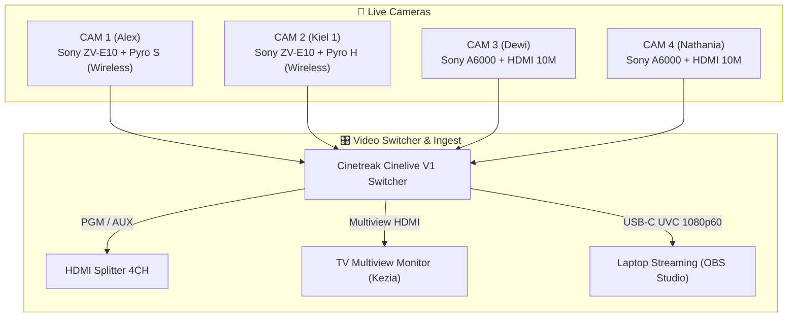
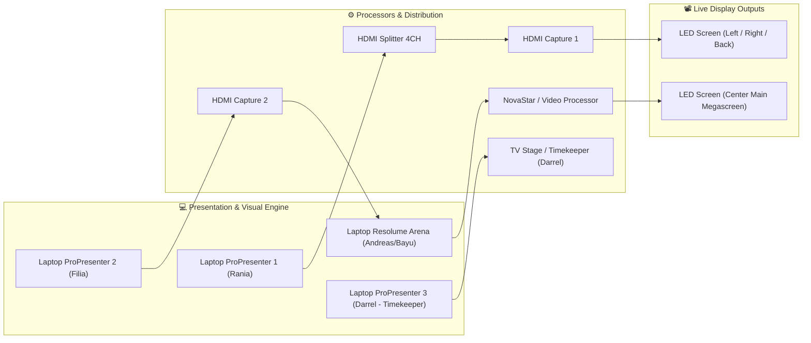
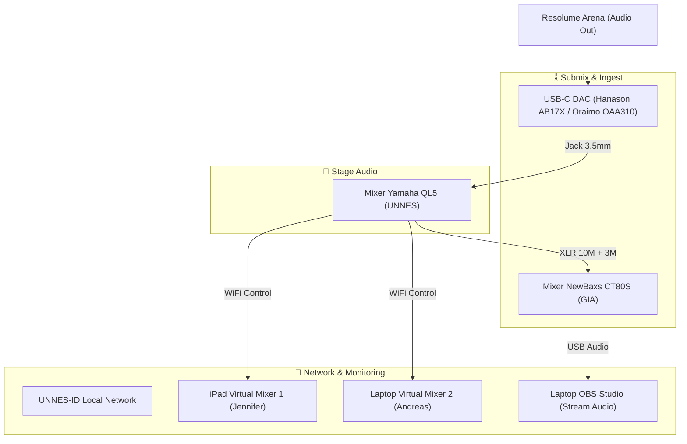

# 🎬 IBADAH PERDANA UKK UNNES 2026 — PRODUCTION & BROADCAST BLUEPRINT

<div align="center">

[](https://zzdree.github.io/ip26-production/)
[](https://github.com/zzdree/ip26-production)

<br/>


<p align="center">
  <b>Comprehensive Technical Architecture, Multi-Camera Broadcast Routing, Audio-Visual Signal Flows, and Master Inventory Management for Ibadah Perdana UKK UNNES 2026.</b>
</p>

[**🚀 Buka Live Command Center & Web App »**](https://zzdree.github.io/ip26-production/)

---

</div>

## 📑 Daftar Isi
- [📌 1. Event Overview & Metadata](#-1-event-overview--metadata)
- [👥 2. Crew Structure & Person In Charge (PIC)](#-2-crew-structure--person-in-charge-pic)
- [📡 3. Broadcast Camera Setup](#-3-broadcast-camera-setup)
- [🔄 4. System Architecture & Signal Routing](#-4-system-architecture--signal-routing)
  - [🎥 A. Video & Broadcast Signal Flow](#-a-video--broadcast-signal-flow)
  - [🖥️ B. Media Presentation & LED Mapping](#-b-media-presentation--led-mapping)
  - [🔊 C. Audio Master & Virtual Mixing Pipeline](#-c-audio-master--virtual-mixing-pipeline)
- [📦 5. Master Inventory & Equipment Loan Log](#-5-master-inventory--equipment-loan-log)
- [📑 6. Rundown & Media Asset Checklist](#-6-rundown--media-asset-checklist)
- [⚡ 7. SOP Operasional & Safety Guidelines](#-7-sop-operasional--safety-guidelines)
- [⚖️ 8. License & Proprietary Notice](#-8-license--proprietary-notice)

---

## 📌 1. Event Overview & Metadata

| Field | Detail |
| :--- | :--- |
| **Event Name** | Ibadah Perdana UKK UNNES 2026 |
| **Venue** | Gedung Auditorium Universitas Negeri Semarang (UNNES) |
| **Organizer** | Panitia Ibadah Perdana UKK UNNES 2026 |
| **Technical & Media Lead** | Andreas & Media Production Team |
| **Live Web App** | [https://zzdree.github.io/ip26-production/](https://zzdree.github.io/ip26-production/) |
| **Primary System Stacks** | Cinetreak Cinelive V1, OBS Studio, Resolume Arena, ProPresenter 7, Yamaha QL5, Hollyland Pyro S & Pyro H |

---

## 👥 2. Crew Structure & Person In Charge (PIC)

```
┌────────────────────────────────────────────────────────────────────────┐
│                        MASTER PRODUCTION CREW                          │
├───────────────────┬───────────────────┬────────────────────────────────┤
│ 🎥 BROADCAST      │ 📸 DOCUMENTATION  │ 💻 MEDIA & ENGINE              │
├───────────────────┼───────────────────┼────────────────────────────────┤
│ CAM 1: Alex       │ Photo: Nico       │ Switcher: Wilfred              │
│ CAM 2: Kiel 1     │ Video: Joel       │ OBS Studio: Andreas            │
│ CAM 3: Dewi       │ Mobile: Jennifer  │ Resolume: Andreas / Bayu       │
│ CAM 4: Nathania   │                   │ ProPresenter 1: Rania          │
│                   │                   │ ProPresenter 2: Filia          │
│                   │                   │ Virtual Mixer: Jordan / Yosua  │
│                   │                   │ Backup Station: Kiel 1         │
└───────────────────┴───────────────────┴────────────────────────────────┘
```

---

## 📡 3. Broadcast Camera Setup

| Camera ID | Operator | Unit / Body | Lens | Transmission & Link |
| :--- | :--- | :--- | :--- | :--- |
| **CAM 1** | **Alex** | Sony ZV-E10 | 18–105mm F4 G | **Hollyland Pyro S Wireless (TX/RX)**, Stand Lighting Small, HDMI 1.5M, Tripod Big |
| **CAM 2** | **Kiel 1** | Sony ZV-E10 | 18–105mm F4 G | **Hollyland Pyro H Wireless (TX/RX)**, Stand Lighting Small, HDMI 1.5M |
| **CAM 3** | **Dewi** | Sony A6000 | 18–105mm F4 G | Tripod Big, Micro-HDMI to HDMI Converter, **HDMI Cable 10M** |
| **CAM 4** | **Nathania** | Sony A6000 | 16–50mm Kit | Tripod Big, Micro-HDMI to HDMI Converter, **HDMI Cable 10M** |

### 📸 Documentation System *(Terpisah dari Broadcast)*
* **Photo Lead:** Nico — *Sony A6400 + 50mm Prime (OWL)*
* **Cinematic Video:** Joel — *Sony A6600 + Zeiss 24–70mm + DJI Ronin RS3 Gimbal*
* **Mobile / Social Media:** Jennifer — *Apple iPhone 15*

---

## 🔄 4. System Architecture & Signal Routing

### 🎥 A. Video & Broadcast Signal Flow


### 🖥️ B. Media Presentation & LED Mapping


### 🔊 C. Audio Master & Virtual Mixing Pipeline


---

## 📦 5. Master Inventory & Equipment Loan Log

<details open>
<summary><b>📦 Rincian Inventaris & Status Peminjaman (Berdasarkan ip26_pro1.txt & ip26_pro2.txt)</b></summary>

### 🏢 1. Peminjaman OWL
- [x] Sony A6000 (2 Unit) ✅
- [x] Sony A6400 (1 Unit) ✅
- [x] Sony ZV-E10 (1 Unit) ✅
- [x] Lens 18–105mm F4 G (3 Unit) ✅
- [x] Lens 50mm Prime (1 Unit) ✅
- [x] Battery NP-FW50 (8 Unit) & Charger (1 Pack) ✅
- [x] Memory Card 32GB (4 Unit) ✅
- [x] Cinetreak Cinelive V1 Switcher + Power Adaptor MIX (1 Pack) ✅
- [x] Hollyland Pyro H Wireless Kit + Power Adaptor WIR (1 Pack) ✅
- [x] Hollyland Pyro S Wireless Kit + Power Adaptor WIR (1 Pack) ✅
- [x] Tripod Camera Big (1 Unit) ✅
- [x] HDMI to Micro HDMI Converter (2 Unit) ✅
- [x] HDMI to Micro HDMI Cable 30CM (2 Unit) ✅
- [x] HDMI Capture Card (2 Unit) ✅

### 🏢 2. Peminjaman UKK UNNES
- [x] XLR Female to Male Cable 10M (3 Unit) ✅
- [ ] Stand Lighting Small (4 Unit) ⚠️ *(Periksa kestabilan)*
- [x] Tripod Camera Big (1 Unit) ✅
- [x] HDMI Cable 10M (1 Unit) ✅
- [ ] HDMI Cable 1.5M (4 Unit) ⚠️ *(Periksa insulasi)*
- [x] HDMI Splitter 4CH (1 Unit) & Power Adaptor SPL (1 Pack) ✅
- [x] HDMI to Mini HDMI Cable 2.5M (1 Unit) ☑️
- [x] HDMI Cable 15M (1 Unit) ☑️
- [x] VGA to VGA Cables (1.5M & 2.5M) & VGA-to-HDMI Converters (2 Unit) ☑️
- [x] Power Cable XPIN & Terminal Cable XCH Master Box ✅

### ⛪ 3. Peminjaman GIA Deliksari
- [x] Mixer NewBaxs CT80S 8-Channel (1 Unit) ✅
- [x] XLR Female to Male Cable 3M (2 Unit) ✅
- [x] USB-A to USB-C Data Cable (1 Unit) ✅
- [x] Tripod Camera Big (1 Unit) ✅
- [x] HDMI to HDMI Cable 1M (2 Unit) ✅
- [x] HDMI Splitter 2CH Powered & Adaptor SPL (1 Pack) ☑️

### ⛪ 4. Peminjaman GKJ Ngaliyan
- [x] Stand Lighting Small (1 Unit) ✅
- [x] HDMI Cable 15M (1 Unit) & HDMI Cable 10M (1 Unit) ✅
- [x] HDMI Video Capture Card (1 Unit) ✅
- [x] HDMI Cable 5M & HDMI Cable 1.5M ☑️
- [x] HDMI Splitter 4CH & Power Adaptor SPL ☑️

### 👤 5. Peminjaman Andreas (Master Toolkit)
- [x] USB-C DAC Hanason AB17X & Oraimo OAA310 24-bit (2 Unit) ✅
- [x] USB-A to USB-C Data & Charge Cables (2 Unit) ✅
- [x] HDMI to HDMI Cable 1.5M (3 Unit) ✅
- [x] Fan Cooler, Precision Mouse Pad, Ext Keyboard & Mouse ☑️
- [x] In-Ear Monitors (QKZ Hi7T, KZ EDX Pro) ☑️
- [x] Fastdrive SSD Vgen 128GB, Toshiba HDD 1TB, Flashdrives Pack (8GB-64GB) ☑️
- [x] Power Adaptor Multiport (USB-A, USB-C PD 65W) ☑️
- [x] Terminal Cables (2CH, 3CH, 4CH, XCH) & Terminal T (8 Unit) ⚠️
- [x] Heavy Duty Tool Box, Jack Box, Screw Box, Cable Ties & Gaffer Tape ☑️

### 👥 6. Peminjaman Tim & Personal
- **ABON:** HDMI Capture Cards USB 3.0 (2 Unit) ✅
- **Joel:** Sony A6600 + Zeiss 24–70mm + Battery (2 Unit) + Memory 64GB + Charger + DJI Ronin RS3 Gimbal ✅
- **Kiel:** Sony ZV-E10 + Kit 16–50mm + Manual 50mm + Battery (2 Unit) + Charger + Memory 64GB/128GB ✅
- **Darrel:** Television Monitor 32 Inch (1 Unit) + Power Adaptor TV + Memory Card 8GB ✅
- **Kezia:** Television Monitor (1 Unit) + Power Adaptor TV & HDMI Cable ✅
- **Jennifer:** Apple iPhone 15 Pro (1 Unit) ✅
- **Lio:** HDMI Cable 1.5M High Speed (1 Unit) ✅
- **Panitia:** Terminal Cable Heavy Duty XCH & HDMI to Micro HDMI Converters (2 Unit) ✅

</details>

---

## 📑 6. Rundown & Media Asset Checklist

| Phase | Media Element | Output Destination | PIC | Status |
| :--- | :--- | :--- | :--- | :---: |
| **Pre-Ibadah** *(Open Gate)* | Playlist (Lagu Rohani) | Sound System (Yamaha QL5) | Sound / DAC | ✅ Ready |
| | Loop Video (Profile UKK, After Movie IP25, IN25) | LED Tengah (Resolume Arena) | Bayu & Andreas | ✅ Ready |
| **Main Event** *(Ibadah)* | Video Opening | LED Tengah (Resolume Arena) | Andreas & Wilfred | ✅ Ready |
| | Video Sambutan Bu Grave | LED Tengah Kanan Kiri | Rania & Andreas | ✅ Ready |
| | Background Tema | LED Tengah | Bayu | ✅ Ready |
| | Background Lagu | Sound System (Yamaha QL5) | Sound Engineer | ✅ Ready |
| | Lirik Lagu | LED Tengah Kanan Kiri (ProPresenter) | Rania & Filia | ✅ Ready |
| | Video Generation | LED Tengah Kanan Kiri | Andreas | ✅ Ready |
| | PPT Pembicara | LED Tengah Kanan Kiri (ProPresenter 1) | Rania | ✅ Ready |
| | Ayat Pembicara & Quotes | LED Tengah Kanan Kiri (ProPresenter 1 & 2) | Filia & Rania | ✅ Ready |
| | Persembahan (QRIS) | LED Tengah Kanan Kiri + OBS Stream | Rania & Andreas | ✅ Ready |
| | UKK News & Pokok Doa | LED Tengah Kanan Kiri | Rania & Filia | ✅ Ready |
| **Post-Ibadah** *(Close Gate)* | **Usung-Usung & Demobilization** | All Crew & Inventory Teams | Seluruh Kru | ⏳ Standby |

---

## ⚡ 7. SOP Operasional & Safety Guidelines

1. **Power & Electrical Routing:**
   - Semua distribusi daya terminal kabel harus menggunakan jalur aman bertanda proteksi (hindari daisy-chaining berlebih pada stopkontak utama).
   - Pastikan power adaptor switcher, splitter, dan mixer terpasang pada terminal stabil dengan cadangan port.
2. **Signal & Wireless Frequency Sync:**
   - Sambungkan transmitter Hollyland Pyro S (CAM 1) dan Pyro H (CAM 2) pada line-of-sight yang bebas hambatan menuju receiver station di samping FOH/Panggung.
   - Lakukan scanning frekuensi RF sebelum acara dimulai guna menghindari bentrokan channel dengan hotspot WiFi auditorium.
3. **Usung-Usung & Teardown:**
   - Setiap PIC bertanggung jawab penuh atas pengecekan fisik dan pengembalian unit pinjaman sesuai daftar inventaris di Section 5.

---

## ⚖️ 8. License & Proprietary Notice

Blueprint dan dokumen konfigurasi ini dilindungi oleh **Proprietary & Confidential License**.
Dibuat khusus untuk keperluan teknis **Ibadah Perdana UKK UNNES 2026**. 
Dilarang menyalin, mendistribusikan ulang, atau menggunakan blueprint ini untuk keperluan komersial pihak ketiga tanpa izin tertulis dari tim produksi.

© 2026 UKK UNNES Production Team & Andreas. All Rights Reserved.
